In June 2026, with the support of the amazing [CTO Craft](https://ctocraft.com)
and [Rands Leadership Slack](https://randsinrepose.com/welcome-to-rands-leadership-slack/)
communities, we surveyed engineering leaders from companies of all sizes to
understand how they use AI and how it impacts security within their teams.

**Contents**

- [Audience](#audience)
- [Everyone writes production code with AI](#everyone-writes-production-code-with-ai)
- [Security and quality are the biggest concerns](#security-and-quality-are-the-biggest-concerns)
- [The top mitigation tools are code reviews and security scanners](#the-top-mitigation-tools-are-code-reviews-and-security-scanners)
- [Conclusion](#conclusion)

## Audience

We conducted the survey with dozens of engineering leaders from companies of
all sizes, primarily across North America and Europe:

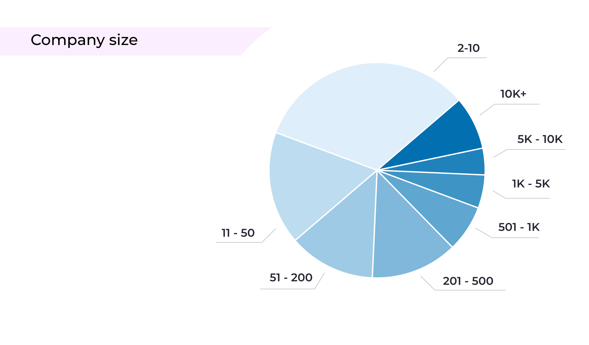

Most companies launched their products before the rise of AI coding, but there
are some newcomers, too:

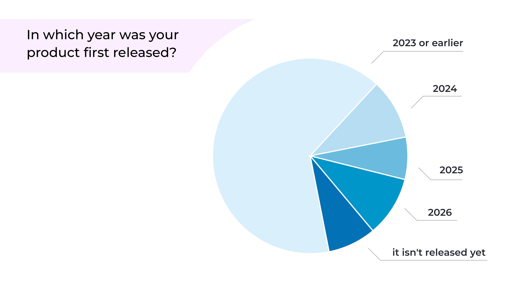

Most of the products these companies are building handle sensitive data and
have either already achieved or plan to pursue compliance with security and
privacy standards:

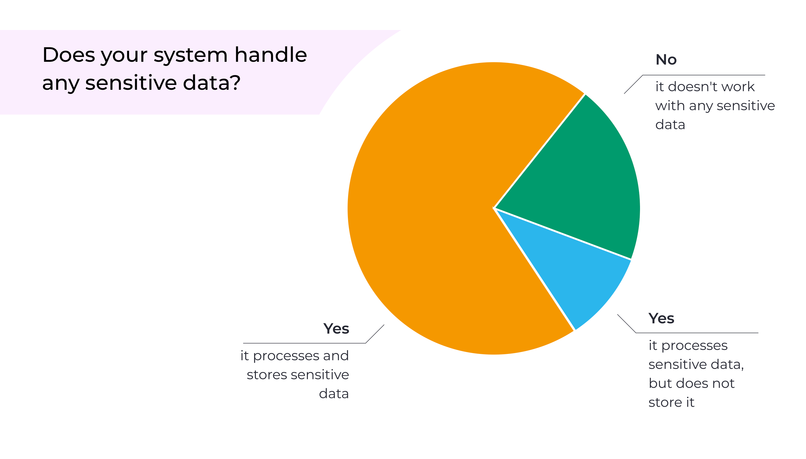

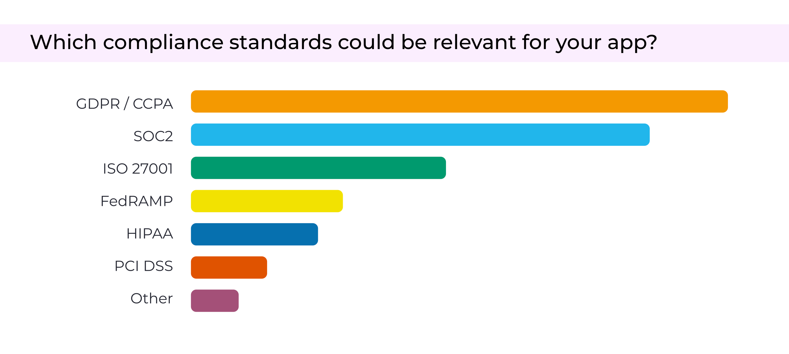

Large companies tend to have a CISO and/or a dedicated security team, whereas
in smaller ones, security usually falls to the CTO or the software engineers:

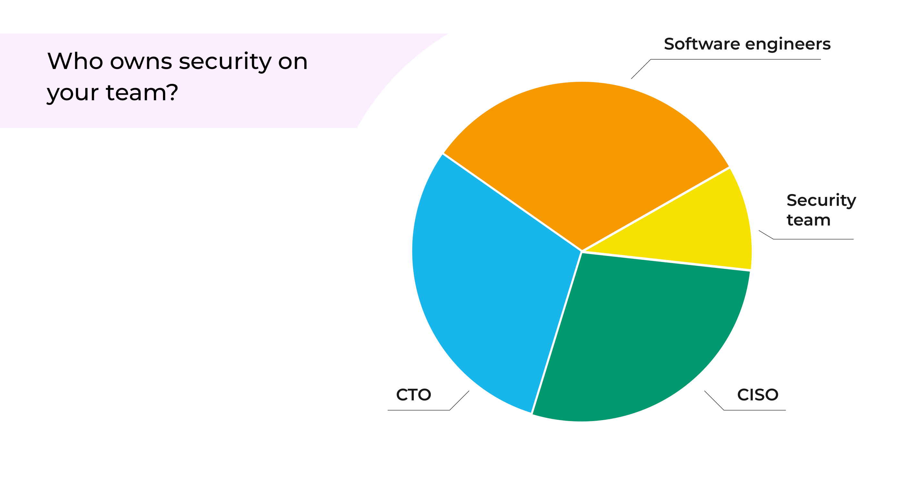

Only about a third of respondents said they currently have junior positions
on the team:

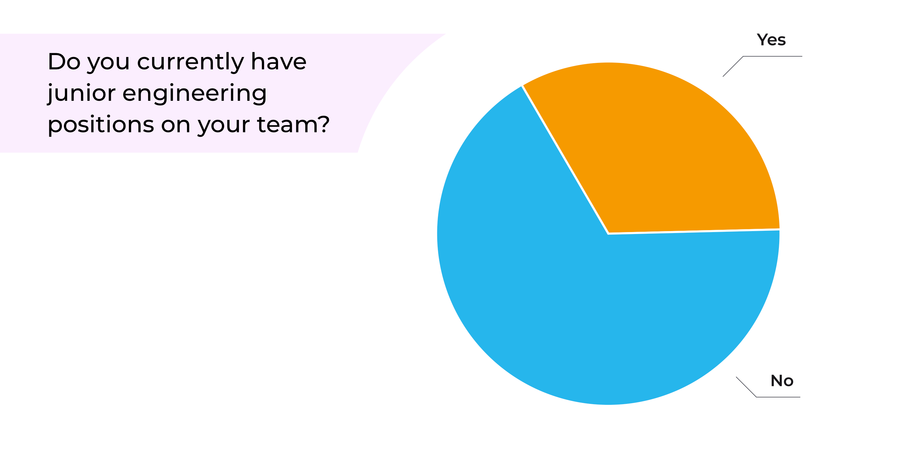

## Everyone writes production code with AI

Every respondent, without exception, said they use AI to write production code.
This appears to be the most widespread application of AI in software
development, ahead of all others:

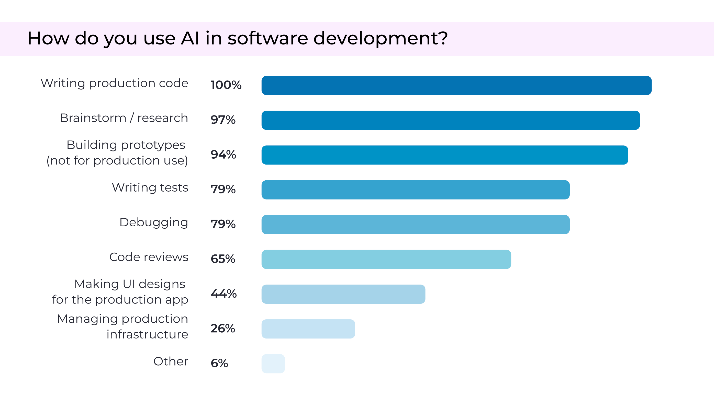

The distribution of AI-generated code in production is fairly even, ranging
from under 25% all the way up to 100%:

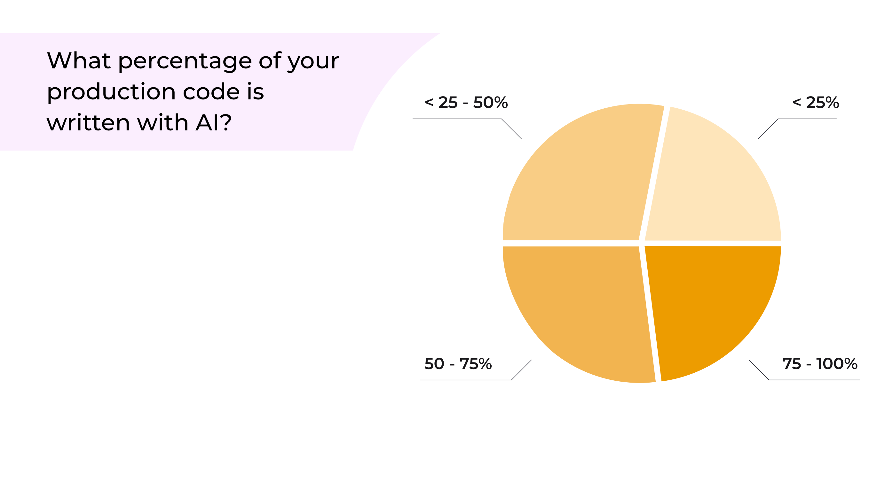

The survey also included the option "0% (no AI-generated code in production),"
but no one selected it.

## Security and quality are the biggest concerns

Most respondents think AI usage may represent an additional risk:

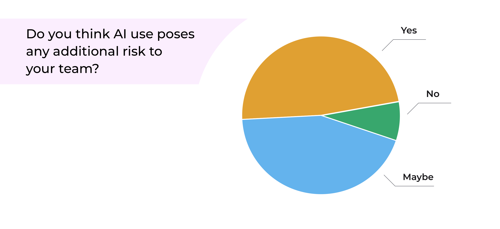

Surprisingly, cost seems to be the least of the concerns. This may be because
we were asking engineering leaders; had we asked CEOs or CFOs, the results
might have looked different:

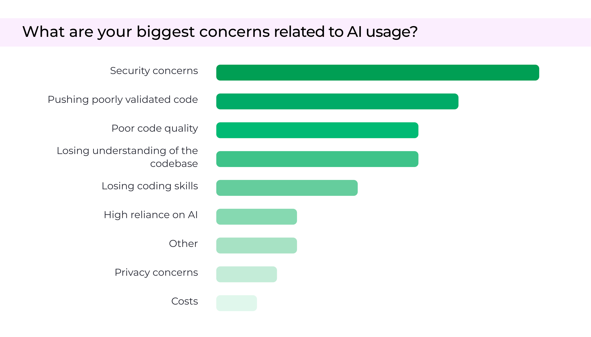

Engineering folks are mostly concerned about security, code quality, and losing
understanding of the codebase. Here are some citations:

> “Fast to write but raises tech debt and security issues or people lack
> understanding of the designs"

> “I've found that coding agents can easily overlook basic security needs,
> whether configuring infra or using unsafe coding practices.”

> “Decreased human attention to the critical pieces of software we're shipping
> to production. Unintended consequences of AI-written code, especially ones
> that accidentally degrade UX and expose new security flaws.”

> “First and foremost is brain rot - forgetting how to do things (from simple
> to complex). Next is reshaping expectations & trust - pushing a lot of code
> with low trust is a very different dynamic than pushing some code with high
> trust.”

> “Over-engineering, as AI makes it easier: before the cost was implementation,
> and now it is less of a burden”

> “Losing manual coding skills, less thoroughly reviewed code, lower code
> quality, broken devs learning process”

Most engineering leaders think their production code may contain
vulnerabilities:

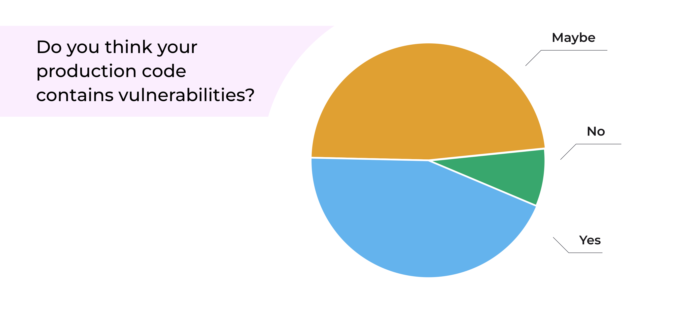

42% of respondents said they experienced a security incident:

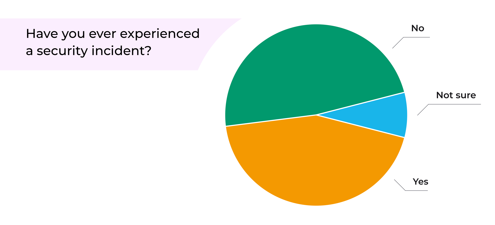

18% of respondents reported experiencing a supply chain attack, roughly half
of them within the past six months:

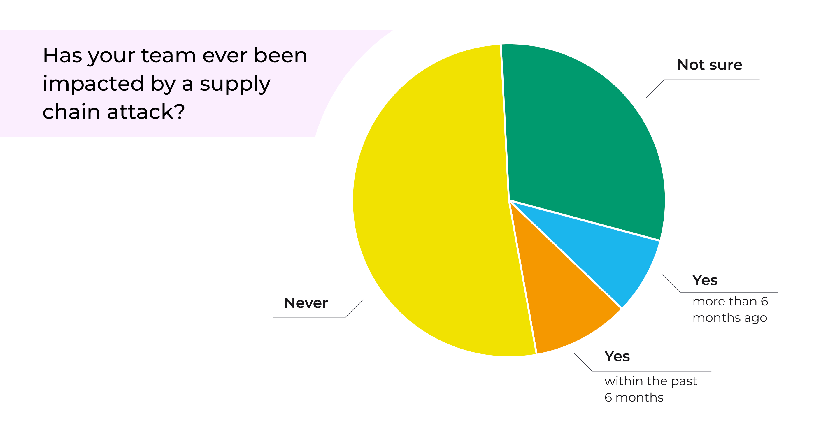

## The top mitigation tools are code reviews and security scanners

So far, there seems to be no substitute for human code review. Although some
people mentioned AI code reviews, these were usually brought up as a complement
to human review rather than a replacement for it.

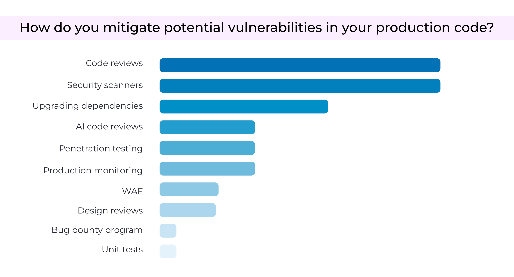

97% of respondents review AI-generated code the same as human-written code or
more strictly:

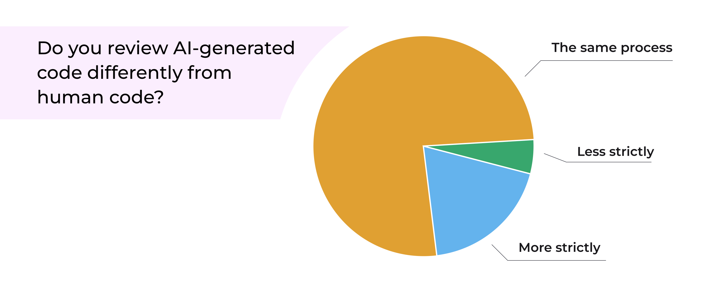

## Conclusion

Two findings stood out to us.

First, everyone is using AI to write production code. That may not sound
remarkable at first, until you realize there were no exceptions. 100% of the
respondents have at least some AI-written code running in production.

Second, contrary to many headlines, cost doesn’t appear to be a problem
yet. Engineering leaders are primarily focused on security and code quality,
with only a tiny fraction citing cost as a concern.
