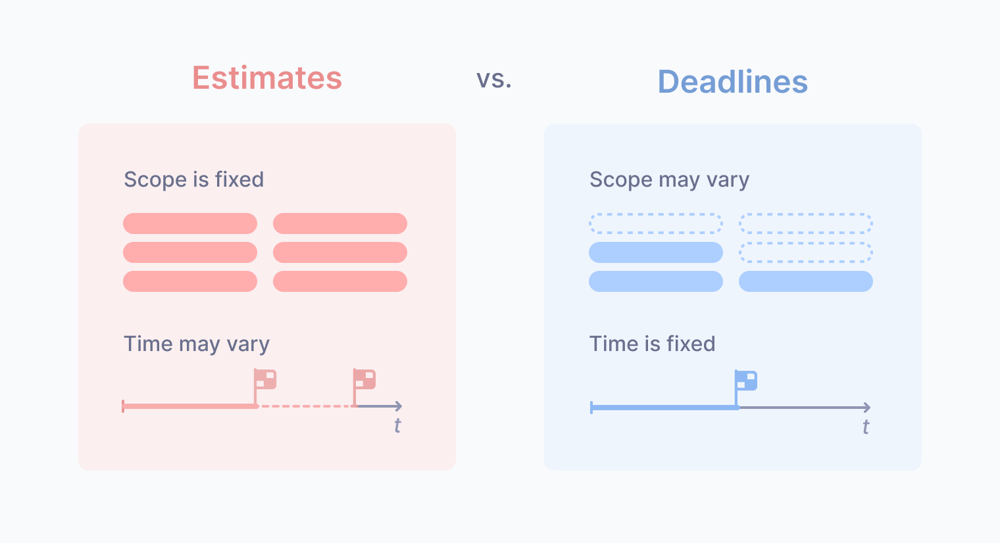

Estimates are ubiquitous in software development. People routinely use them for
planning, prioritization, and managing expectations. All these activities are
crucial for project management, but are estimates really the best tool for the
job? Surprisingly, often, the answer would be "no." In this post, we'll explore
how [estimates slow us down](#estimates-slow-us-down) and what alternative
tools we could use instead:

- [Due dates, a.k.a. Deadlines](#meet-deadlines) if we need to fit into a
  certain timeline and/or budget;
- [T-shirt sizing](#t-shirt-sizing) for tasks prioritization;
- [Regular check-ins](#regular-check-ins) to identify stuck progress, minimize
  waste, and manage expectations better;
- [Postponed estimates](#what-if-we-actually-need-an-estimate) when you just
  need a classic estimate.

## Estimates slow us down

One of the most unpleasant effects of relying too much on estimates is that
they slow the team down. Here's how it happens.

### 1. Initial estimates are very uncertain

Managers are most interested in estimates before starting work on a task or a
project, which is quite understandable. Unfortunately, this is also the time
when estimates are the most unreliable. This effect is known as the
[Cone of uncertainty](https://en.wikipedia.org/wiki/Cone_of_uncertainty) - the
more we work on the project, the better we understand how long it might take:


There were studies on how big that initial estimation error might be. It turns
out that in software projects, it can be up to 4x off in either direction. For
example, when people say "a couple of weeks," it could be anywhere between 2-3
days and a couple of months! Such a huge range may sound surprising to some,
but ask any seasoned developer, and they will recall numerous cases from their
practice when a "quick one-day task" ends up taking many weeks.

### 2. Developers quickly learn to overestimate

Of course, no one wants to deal with estimates that range from a few days to a
few months. Managers are asking for estimates because they need something to
rely on, and such a wide range isn't helpful in this regard. They expect
estimates to be more precise and perceive them as some kind of promise. If a
developer is lucky enough to finish the task faster than expected, this is
great, and no one would complain. But if the work is delayed, people may become
frustrated. So there's a natural incentive for developers to overestimate—it's
just safer for them.

At first, developers tend to be optimistic about timelines, but they quickly
learn that their estimates often fail, which could be an unpleasant experience.
They realize that it makes sense to add a safety margin, and estimates go up.

### 3. Work expands so as to fill the time available for its completion

If developers overestimate, they must complete most of their work earlier than
expected, right? Nope! This is where
[Parkinson's Law](https://en.wikipedia.org/wiki/Parkinson%27s_law) comes into
play:

> Work expands so as to fill the time available for its completion.

So this is how estimates slow us down - developers overestimate, and then that
pessimistic estimate becomes the earliest date when the work could be finished.
Unfortunately, there's no easy workaround for it. Pressuring developers to give
lower estimates demotivates the team (why are you asking us if you already know
how long it must take?) and will backfire because there are reasons why they
overestimate.

### Bonus: additional slowdown due to introduced misconceptions

Estimates also introduce dangerous misconceptions that further slow down a
process that heavily relies on estimates. As Frederik Brooks famously noted in
[The Mythical Man-Month](https://en.wikipedia.org/wiki/The_Mythical_Man-Month)
book,

> Men and months aren't interchangeable

If one developer can complete a project within a month, it doesn't mean another
developer can do the same. Maybe they can or maybe not; it depends on their
skill, experience, productivity, and how well they know this project area.
However, this important aspect is often neglected. For example, in SCRUM,
people plan their work relying on universal task estimates and "team capacity,"
while in reality, performance may vary significantly depending on who is
assigned to which task.

It contributes to the list of reasons why people reserve extra time in project
plans to handle various "unexpected situations." But for whom this situation is
"unexpected"? Most managers would agree that generally speaking, men and months
aren't interchangeable. However, it's really hard to account for that in
frameworks like SCRUM, so people consciously choose to ignore it and just add
some extra time to hide planning inefficiencies.

## Predictability comes at a cost

It is understandable that people want their software development process to be
predictable. Many organizations go to great lengths to achieve this, for
example, by estimating all of their work, calculating team "velocity,"
introducing burndown charts, and encouraging developers to give "more accurate"
estimates. The truth is, it has its price, and the price is slowness.

Software development has some unpredictability by nature because it's not a
fully repeatable process. Of course, there are some routine tasks, but
developers don't spend too much time on them due to code reuse and automation.
Most of their time is spent on something new. It could be working with a new
library or an API that they didn't use before or debugging a tricky bug.
Developers simply don't know how long it might take, so their only way to
achieve predictability is to overestimate.

For some companies, sacrificing speed is a reasonable tradeoff for
predictability. However, if you are interested in moving faster, it makes a lot
of sense to accept that software development can't be fully predictable. We'd
better allow some degree of variation and uncertainty. That doesn't mean that
the project would become chaotic and unmanageable, though. In the chapters
below, we'll explore techniques for managing projects without relying on
estimates too much. We aren't going to throw away estimates completely. It can
be a useful tool, but it should not be the only tool in the manager's toolbox.

## Meet deadlines

Let's talk about situations when we need to fit into a certain budget and/or
timeline. For example, we've got a small "idea-stage" investment for our
startup, and we have a few months to demonstrate its potential to get more
funding. Another example - we're running an e-commerce store and would like to
upgrade our discount and bonus program before Black Friday. These are examples
of natural deadlines, when we need to get something out of the door before the
deadline, or the world will move on without us. In such situations, we'd better
operate in the "deadline mode" rather than "estimate mode."

### Deadlines aren't bad

Deadlines may sound scary. They're often associated with stress, burnout,
cutting corners, or poor planning overall. Even the word itself sounds bad—we
certainly don't want anyone to die! Such a bad reputation pushes people away
from deadlines towards "safer" estimates, which I think is very unfortunate.

Of course, there are many ways to abuse deadlines, like setting arbitrary
deadlines or asking for estimates and then treating them as deadlines. However,
as shown above, there are plenty of ways to abuse estimates, too. Estimates
aren't "safer". Neither deadlines nor estimates are a bad concept. They are
just tools, and how we use these tools makes all the difference.

### Estimates vs. deadlines

On the surface, estimates and deadlines may look like close concepts. They both
are about the project completion time, but they work very differently. When we
ask for an estimate, we assume that the project scope is more or less fixed and
the completion time is flexible. When we set a deadline, the time is fixed,
but we must accept that the scope may vary:



It might be tempting to fix both scope and time, but experienced managers know
this is a bad idea. Either we won't be able to complete everything, or there
will be problems with quality, or the timeline must be so relaxed that the
project won't look viable from the business perspective. So, when setting a
deadline, allow flexibility in the scope.

### Deadlines facilitate prioritization

When we might not have enough time to complete everything, we naturally ask,
"Okay, what's the most important?" Great question! There are usually many ways
of achieving the same goal when building software, and not all features and
requirements are equally valuable. Time constraints force us to set priorities,
and clearly defined priorities significantly reduce the project risks.


### Meeting deadlines reliably

The approach that we use at ivelum when we need to meet a deadline is a
combination of the Fix Time and Budget, Flex Scope technique, and Continuous
Delivery:

1. Write down all known requirements as separate features, which we could ship
   independently;
2. Prioritize the features from the most important to the least important;
3. Establish conditions for Continuous Delivery - ensure that the production
   environment and CI pipelines are ready;
4. Ship the updates frequently, starting with the most important features, and
   keep the system fully functional at all times.

Continuous Delivery helps further de-risk the project by ensuring that the MVP
lands in production as early as possible. After that, we continue adding
features to it, trying to build as much as possible before the deadline and
continuously testing the new system as a whole.

### When deadlines work best

Deadlines work best when there's a natural deadline that we can easily explain
to the team, and explaining it is important. First, we need to get a commitment
from the team, and people are reluctant to commit to arbitrary deadlines (which
is quite understandable). Second, it guides our prioritization. Knowing why the
deadline is set helps us understand what would be critical to ship by that date.

However, deadlines shouldn't be ubiquitous, even with the best explanations and
reasoning. Definitely don't put a deadline on every task 🙂

## T-shirt sizing

Another common reason why people ask for estimates is prioritization. The
common logic is this - if it's a quick task, let's do it now, or if it takes
significant time - maybe postpone. While the initial implementation time
shouldn't be the only criteria taken into consideration, having this
information could be helpful, especially for non-technical managers.

T-shirt sizing provides a very rough estimate of how large the task could be -
S (small), M (medium), or L (large). It allows managers to compare tasks to
each other and helps make decisions on their priorities.


If the task looks large, try to explain why it looks large. Can it be
simplified so that we can achieve the same goal with less effort? Quite often,
this is possible.

Please note that it's very important to avoid linking these sizes to the
estimated completion time. As soon as people start to associate these sizes
with concrete date ranges, we are back to classic estimates with all their
shortcomings.

Story points in SCRUM tried to mix the same idea with better predictability and
utterly failed. Everyone quickly learned to convert these magic numbers to days,
which is unsurprising, as they're used for planning on fixed periods (sprints).
Even [the story point's inventor regretted inventing them](https://ronjeffries.com/articles/019-01ff/story-points/Index.html).
Don't repeat this mistake; don't tie t-shirt sizes to date ranges.

## Regular check-ins

Sometimes, managers treat an estimate as a checkpoint when to communicate with
the developer next time:

```
- Hey, how long it might take?
- Maybe a couple of weeks?
- Okay, I'll check back in a couple of weeks.
```

It may sound reasonable at first—we don't want to distract developers while
they're working, so why not check back when they're supposed to finish? The
problem is that it could be too late. There are many unknowns that developers
unpack one by one as they progress through the task.

Frequent discussions of progress help identify bottlenecks and allow us to
adjust requirements on the fly if it turns out that the original task is more
complicated than we initially thought. The optimal check-in schedule may vary
from one team to another. Some use daily standups, while others prefer weekly
or another schedule. Standups are usually associated with SCRUM, but you don't
have to go full-SCRUM to do standups—just do standups! When done right, they
minimize waste of time and keep the manager well-informed about the real
situation on the project.

## What if we actually need an estimate?

Even if we effectively use all of the tools above, there could be situations
where we still need to get a classic estimate to communicate it to clients or
stakeholders. In such cases, **ask for it later**, if possible.


Remember about the Cone of uncertainty - the more we work on the project, the
better we understand when it can be completed. When developers haven't started
yet, they may have no idea. However, as they make progress, it should become
more evident what it'll take to complete the project, and we'll likely get a
more reliable estimate that would be safer to communicate to someone else (with
a safety margin on top of it, of course 🙂)

## Summary

Estimates are overused in software engineering, which often leads to poor
planning and underwhelming team efficiency. While estimates have their place,
they shouldn't be the only tool in the manager's toolbox. There are other tools
that work better in many situations:

- If you have a timeline to meet - [use deadlines](#meet-deadlines)! Being
  flexible with scope, rigorous prioritization, and continuous delivery is a
  recipe for success;
- If you need to decide what to work on next - consider
  [T-shirt sizing](#t-shirt-sizing) estimates and if the task looks large, try
  to figure out why;
- There's no need to ask for an estimate to decide when to check the task
  progress next time - just [check it regularly](#regular-check-ins), no matter
  what, and the progress will be more reliable;
- Finally, if you
  [just need a classic estimate](#what-if-we-actually-need-an-estimate) measured
  in days - see if you can give developers a few days to work on the task
  before asking for an estimate. It significantly improves the chances of
  getting a more accurate figure.
