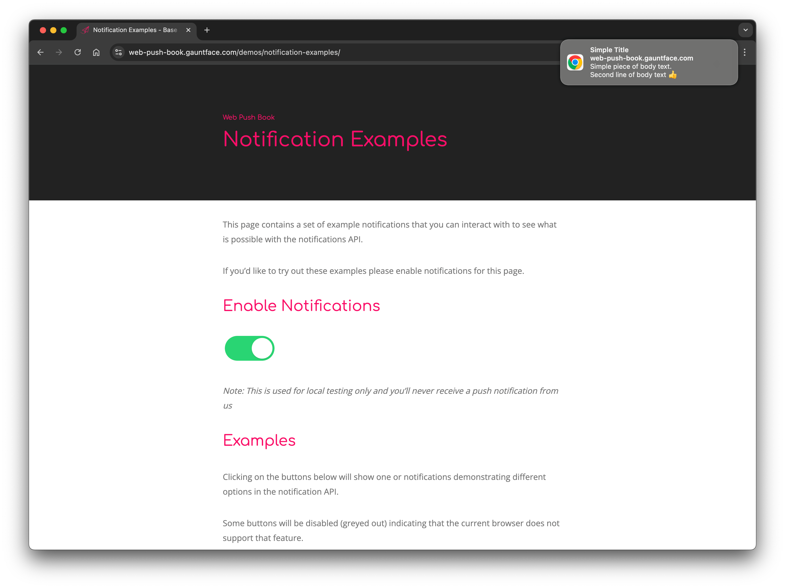
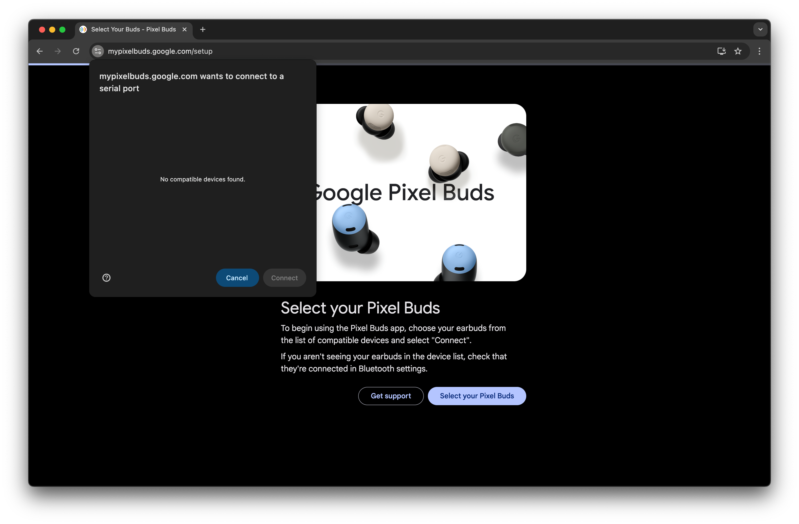
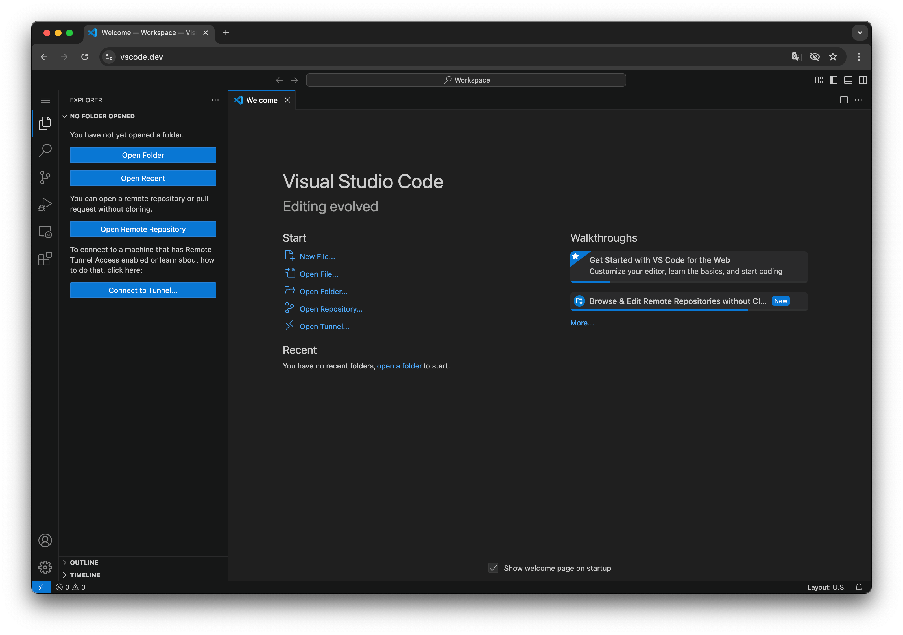
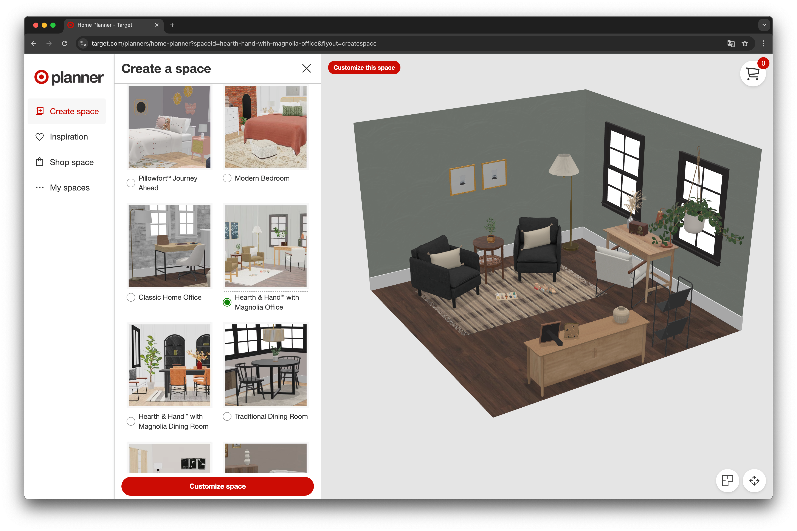
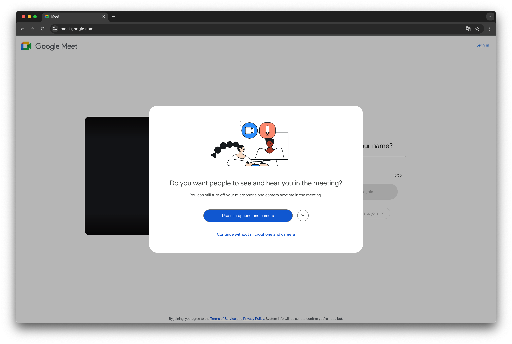
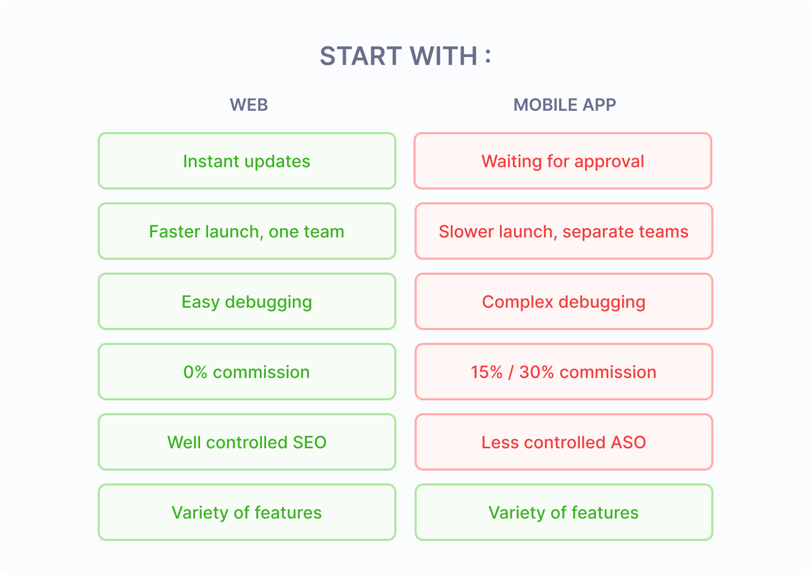

Many new project founders believe launching a mobile app is the best way
to launch a product. It might seem a good choice since mobile usage
dominates the digital market. However, a mobile-first approach often
carries unnecessary risks for the early-stage assessment of an idea,
such as spending too much money on a concept that ends up not working.

MVPs are all about testing hypotheses with a minimal investment. That’s
why a web-based app is often a smarter, faster, and more cost-effective
approach. Read on and discover why.

## A website enables faster launch and iterations

**Web development offers the fastest way to develop a solution that works everywhere.**
It's the most cross-platform technology, running on practically
every device—smartphones, computers, and even IoT devices like TVs. That makes
the development process more manageable—one codebase for all platforms; a single
development team; and a strong focus on feature quality instead of having to
check feature compatibility on different platforms.

Once you’ve designed and developed a web app with a responsive interface, you’re
good to go on any device. With nearly 68% of global web traffic coming from mobile
devices [SimilarWeb](https://www.similarweb.com/platforms/), targeting a broad
mobile audience is a realistic and effective goal that can be achieved through
web development without the complexities of native app development.

What are those complexities? Native mobile development (Swift/Kotlin) requires
separate codebases for iOS and Android, leading to higher costs, increased
coordination efforts, and more development time spent. 

Even with cross-platform frameworks like Flutter or React Native, developing a
single project for mobile platforms doesn't automatically provide a web or
desktop version.

**A website allows instant updates.** A single codebase hosted on centralized
servers can be updated quickly, ensuring that all users run the latest and,
most importantly, the same version of the application. This simplifies user
support, simplifies server-side maintenance, and eliminates the need to keep
outdated APIs for users who haven't updated their apps.

For native apps, updating is more complex. Separate builds must be created
for each platform, multiplying development effort and costs. While cross-platform
frameworks help mitigate this, minor platform-specific tweaks might still be
required. Moreover, the update process is less controlled: there are delays
caused by app store moderation. Also, users often skip or delay updates. As
a result, development teams are frequently forced to maintain a cohort of
legacy versions, adding complexity and technical debt over time.

**Debugging is easier on the web.** The server side remains entirely controlled,
allowing for thorough monitoring and logging. Browser incompatibilities were
a pain in the past, but the situation has improved significantly. Modern browsers
do a decent job, it's much easier to work with them now.

In contrast, native applications must be tested across many devices, OS versions,
and screen resolutions. Debugging becomes significantly more complex, as certain
issues may only appear on specific devices. Often, the best data available are
crash reports, which require deep investigation (which costs time and money)
to identify the problem.

## Websites can do more than you think

Modern web apps have evolved over time. Platforms like Figma and Miro are prime
examples of how powerful browser-based solutions have become. While they can be
downloaded as desktop apps, they still are web applications wrapped in a native
shell, delivering a seamless, native-like experience.

Here are a few examples that illustrate how powerful the web is:

- **Geolocation and GPS.** Browsers can determine a user's location using GPS on
mobile devices and laptops or via IP-based geolocation on other devices. Starbucks'
website, for instance, detects a user's country to suggest the closest coffee
place to visit.

- **Notifications.** Like native mobile apps, modern browsers support push notifications,
allowing web apps to send updates, alerts, and promotional messages even when the
website is not actively open. Mobile platforms also support notifications via APIs
or with the help of notification providers like OneSignal.

- **Hardware access.** Browser APIs enable direct connection with external devices.
This allows a simple web page to interact with IoT gadgets, printers, controllers,
and specialized equipment without requiring a native app. For example, the Pixel
Buds Pro Web Companion utilizes the Web Serial API to interact with the earbuds.
This application enables users to adjust multiple settings on their Pixel Buds Pro,
including noise cancellation, the equalizer, in-ear detection, and firmware updates.
(The image is )

- **Local storage.** Tools like IndexedDB, File Handling API, and Cache API allow
developers to store data locally. For example, the web version of VSCode
[saves](https://code.visualstudio.com/docs/editor/vscode-web#_saving-and-sharing-work)
changes in the browser's local storage while working on a remote repository until the
next commit is pushed. Another example is the Photopea image editor, which lets users
open files from their file explorer.

- **WebGL and advanced rendering.** WebGL libraries like Three.js and Babylon.js deliver
high-performance 3D graphics within the browser, enabling interactive visualization,
gaming, and AR experiences. Retail giants like Target and Macy's have built web-based
room planners that utilize WebGL to help customers visualize furniture layouts before
purchasing.

- **Camera and microphone.** Video conferencing platforms like Google Meet and Jitsi Meet
demonstrate that real-time video and audio communication can be handled entirely through
the browser.

There is a misconception that native mobile apps undeniably have full, low-level access
to all device capabilities and therefore, are better to build an MVP than a web app.
However, the list above is a good example of how a growing number of browser APIs is
rapidly closing the gap between web-based and mobile apps. 

## Business perspective

**A web-based solution improves unit economics from day one.** When integrating payments,
full control over payment services provides the best conditions, supporting both one-time
purchases and subscriptions. In contrast, listing an app on the App Store or Google Play
can result in significant revenue loss due to platform fees—15% or 30% as the user base
increases.

**Web services are better at encouraging people to use them.** With modern browsers
preinstalled on nearly every device, the web app is one click away—whether from a smartphone,
laptop or even a smart TV. On the other hand, mobile apps introduce additional steps:
navigating to the app store, downloading, and installing the app. This extra friction can
discourage users, especially those hesitant to install yet another app for occasional use.
Additionally, public app store reviews are highly visible on the app listing, meaning even
a few negative experiences can scare potential customers before they try the product.

**Marketing for web-based services follows a well-established process.** SEO tools drive
organic traffic, and instant updates ensure that new features, product experiments, and
marketing campaigns can be rolled out without delay. In contrast, marketing a native mobile
app is less predictable. App Store Optimization (ASO) is highly dependent on store algorithms,
which are basically undisclosed. Users who disable auto-updates may never receive new
features, complicating retention efforts. App store review processes further slow down
feature releases, and sometimes updates are rejected, resulting in decreased product metrics.

## When developing a mobile app might make sense

At first glance, a web app seems to outperform a native mobile solution in most cases.
However, there are two scenarios where developing a native mobile app as an MVP might
be justified:

1. **Mobile-first market launch.** In industries where competitors are mobile-first—such
as Uber services, navigation apps, or messaging platforms—a native mobile app must be
developed to compete effectively. Still, launching a mobile-first product remains a
high-risk investment.

2. **Expanding an established product.** If a proven product or service is already in
place, a native mobile app can enhance user experience. However, even in this scenario,
the web often serves as a better starting point, allowing for faster iterations and
validation before committing to full-scale native mobile development.

## Conclusion

Numerous successful products have demonstrated that a strong web-based service can
thrive—from simple QR-code restaurant menus to powerful industry-standard tools like
Figma. These examples highlight the web's ability to support everything from lightweight
services to full-fledged professional applications.

When developing an MVP, the main goal is to validate hypotheses as fast as possible and
then iterate quickly based on users’ feedback. Web applications excel in these areas,
enabling rapid development, instant updates, and a seamless cross-platform experience.
If the concept proves successful, transitioning to a native mobile app remains an
option—but without the upfront risks and constraints of mobile-first development.