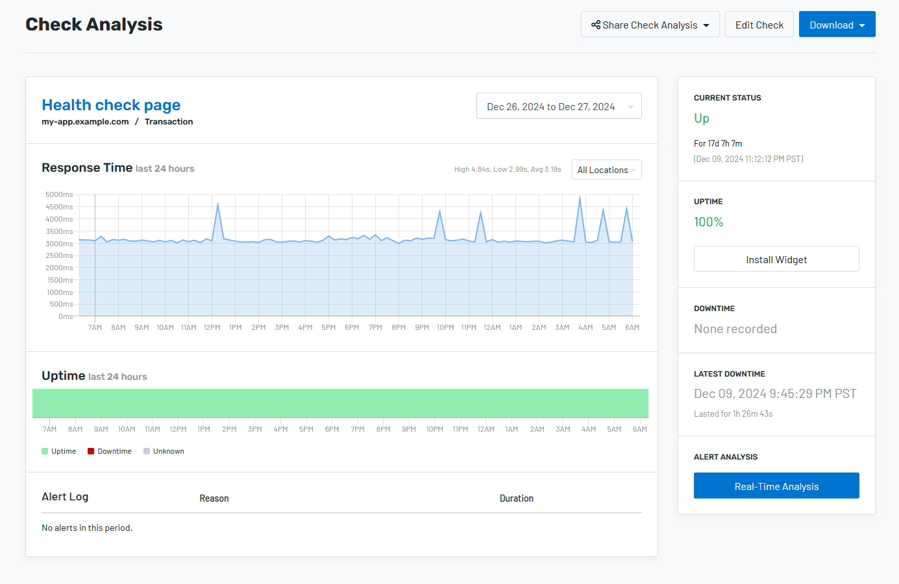

Imagine an e-commerce solution that went down right before Black Friday!
Downtime or failures could result in disaster, so they should be noticed
and fixed ahead of time. But deciding what to monitor can be challenging
when there are so many options. In this article, we’ll explain different
metrics and share an easy, low-cost way to start your monitoring routine
that covers the most basic needs.  

If you’re looking for a quick recipe for a new project,
skip to [**The Starter Pack**](#the-starter-pack). Or, bear with us and learn
more about potential choices.

Let’s say a site is unavailable. The developers might release a new update
and shut it down during the rollout, or the cloud infrastructure provider
could experience a major failure, leaving its servers offline. Anyway,
downtime must be detected and eliminated.

But just because the site looks like it is working doesn’t mean it really
is. Errors could go unnoticed, but still be there. Imagine how frustrating
it would be to spend a long time finding something you want in an online
store only to realize in the end that you can’t pay for it—because of a bug!

One way to be notified about problems is to get feedback from users.
Unfortunately, frustrated users might just leave without providing
any feedback— and never come back. 

The good news is that there is a better way to make sure things will work
as expected—automated app monitoring. 

## So many things to be monitored!

In large, mature projects, everything has to be monitored, and for a good
reason—there are many things that could go wrong. So, how should we tackle
this task? Here’s a list of monitoring metrics:

### Infrastructure monitoring

Infrastructure monitoring tracks servers’ uptime and resource
allocation. These metrics show that the server is up and running
and that the app uses resources efficiently without memory leaks,
disk space shortages, or CPU overload. 

Modern cloud providers offer extensive infrastructure metrics,
simplifying the monitoring process. 

### Application Performance Monitoring (APM)

Application Performance Monitoring services track application-specific
metrics, such as the number and types of requests it handles,
response time, error rate, etc. These metrics provide an overview
of the app's performance and possible optimization points.

### Error monitoring

This type of monitoring service specializes in collecting
crash reports. Analyzing exceptions thrown by the application
helps the team detect and fix bugs that have reached production. 

Besides bugs in the code, crash reports can indicate other problems,
such as infrastructure issues, third party service outages, or
unexpected changes in external services' behavior.

### Uptime monitoring

Some problems may go unnoticed by infrastructure and application monitoring.
For example, if our hosting provider experiences a major outage, we probably
won’t get any alert from our internal monitoring, yet the app will be down.
The same situation might happen if the app is deployed incorrectly.

That’s why we need to check if the website is available from the user’s
perspective in different locations. 

### Business metrics

Aside from purely technical things, we also need to keep an eye on
what is valuable for each business. For example, for media websites,
page views matter; for an e-commerce store, it’s about order volume;
for a SaaS app, it's about active users, revenue, and customer churn. 

Business metrics are an additional monitoring layer to check for
anomalies and hidden problems that are not identified by other tools.
For example, a sudden drop in orders in an online store could force
the development team to investigate any issue thoroughly, even if
other error checks are overlooked.

## The Starter Pack

Once again, in mature applications everything has to be monitored.
However, the teams behind these apps didn’t get there in one big step, all at once.
Improving monitoring capabilities is an ongoing process. However,
starting a new project still requires a first step. 

Based on our experience, reaching a reliable and stable production
for most new projects is possible using **the Starter Pack: 
error monitoring plus uptime monitoring**.

Why these two? Because they are relatively easy to implement,
and they provide decent coverage. 

And this is how it works: an error monitoring service catches exceptions
and regressions as they occur. It also sends messages to the team chat,
helping devs get detailed information about the problem. However, if the
application fails to start, it won’t report anything because there’s no
application running to throw errors. This is where an external monitoring
tool comes into play. It checks whether specific web pages or API endpoints
for the service are available.

To summarize, all types of monitoring exist for good reasons, and as the project
matures, you shouldn’t hesitate to invest in better production monitoring. However,
uptime and error monitoring give just enough reassurance to launch a new project
for the first time, knowing it will be reliable and stable enough. 