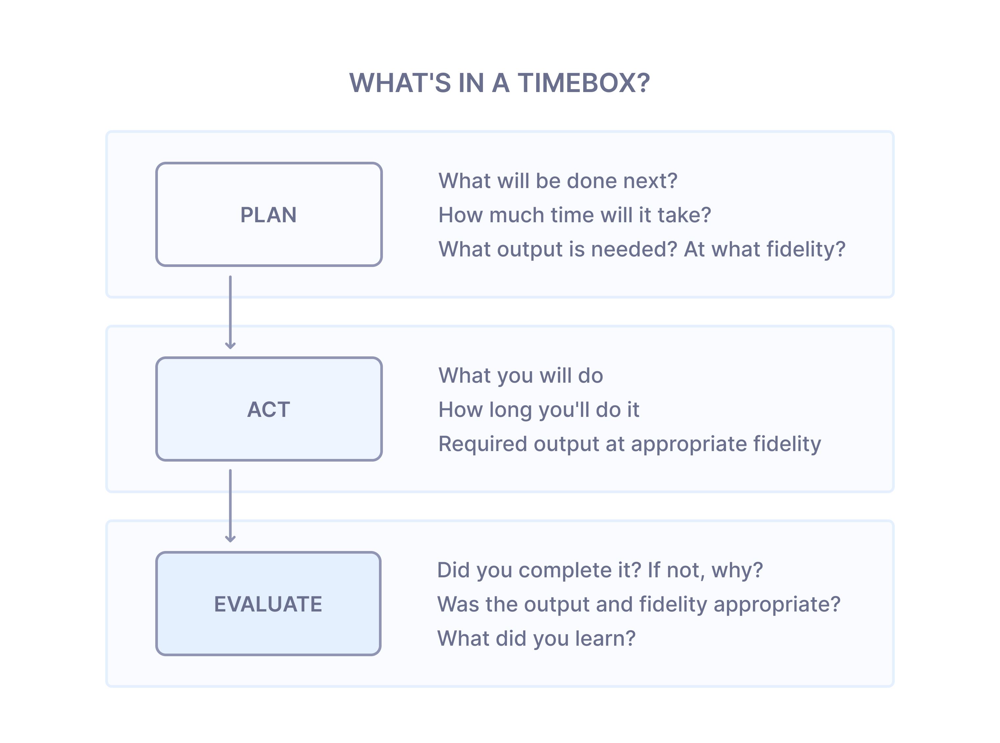

Time estimates have long been part of the DNA of software development.
They’re how we bring structure to chaos, manage expectations, and plan
for the work ahead. Managers use them to allocate resources and set timelines,
while developers use them to evaluate feasibility and guide their efforts.
On the surface, it makes sense—they’re an established way to navigate complex projects.

But here’s a question: do estimates really solve the problems we think
they do? Do they help us meet deadlines more reliably, prioritize better,
or align our teams effectively? Or are there times when they create more
challenges than solutions? Instead of diving straight into criticism,
let’s take a step back to understand why we use estimates, where they
shine, and where they might fall short.

## Why Do We Rely on Estimates?

Estimates exist for good reasons. They give us a way to make sense of
uncertainty and help address some big questions in project planning:

- Can we deliver this project on time or within budget?
Stakeholders need to get an idea of how realistic their goals are—if
they are achievable within limits. Estimates seem to be the answer to this.

- What should we work on first?
Teams often use time estimates to decide which tasks to prioritize,
especially when juggling competing demands.

- Does everyone understand what we’re doing?
Sometimes, estimates act as a quick gut check. If a developer’s
timeline feels wildly off from a manager’s expectation, it can
flag a potential miscommunication.

These are all valid reasons to lean on estimates. But if we
look closer, it’s fair to ask whether they’re the best tool
for every situation—or whether they sometimes give us a false
sense of security.

## Do Estimates Really Deliver What We Want?

**When it comes to feasibility, the devil’s in the details.**
One of the biggest challenges with estimates is that they’re often
made at the very start of a project—when uncertainty is at its peak.
This is where the "Cone of Uncertainty" comes in. 

At the beginning, estimates can vary wildly, sometimes by a factor of
four in either direction. A two-week task could take two days—or two
months. Even knowing this, clients often assume estimates are promises, 
which can lead to unrealistic expectations and frustration when things
inevitably go off track.

**Prioritizing seems simple, but in reality, it is complicated.**
Time estimates are often used to decide what to work on first. If Task A
takes a week and Task B takes three, it seems logical to do Task A first.
But this approach focuses only on time, without factoring in things like
complexity, dependencies, or impact. Sometimes, an apparently quick solution
can turn out to be more complicated and time-consuming than expected, throwing
off the plan entirely.

**Do estimates ensure everybody will be on the same page? It’s a bit hit-or-miss.**
Using estimates to gauge alignment can help, but it’s not directly related.
A wildly off-base estimate might signal a misunderstanding, but close estimates
don’t necessarily mean everyone’s on the same page. Discussing specifically
how to tackle a task usually works better to ensure alignment.

## How to Work more efficiently Without Over-Relying on Estimates

So, what’s the alternative? The goal isn’t to avoid estimates entirely—it’s
to complement them with strategies that work better for the realities of
software development.

### Flexible deadlines can be the key.

Instead of estimating how long a fixed scope of work will take, use the
“fixed time/budget and flexible scope” approach. For example, if a startup
has six months of funding, the goal might be to deliver a Minimum Viable Product
(MVP) in that period of time. The exact same features in the MVP can remain flexible,
letting the team adapt as they go. This approach works with results instead of
predictions and boosts creativity and focus.

### Timeboxing helps teams stay on track.

With timeboxing, a fixed length of time is allocated to a task and the best possible
result is achieved within that timeframe. For exploratory work, like researching
a new library, this ensures steady progress without letting perfect become the
enemy of good. For example, a team might decide, “Let’s spend a day picking
a library and move forward with our top choice.”

### Continuous delivery keeps the momentum going.

By delivering small, incremental updates frequently, teams can avoid the risks
of large, infrequent releases. This approach ensures quick feedback and maintains
progress, shifting the focus from trying to predict timelines to delivering
value consistently.

### Focus on results instead of deadlines.

Rather than asking, “How long will this take?” try asking, “What can we accomplish
in the next sprint that has the most impact?” This subtle shift helps teams
prioritize based on value rather than just checking tasks off a list. It’s about
doing the right work, not just more work.

### Direct discussions ensure alignment.

Sometimes, estimates are used as a way to find out if a developer understands
the task. If their estimate matches the lead’s expectations, it’s often assumed
they’re aligned. However, this approach can be unreliable. Similar estimates
don’t always mean shared understanding, and mismatches might not help identify
the root cause of the disagreement.

A more effective alternative is to ask the developer to explain their plan.
Instead of guessing alignment from numbers, have a direct conversation:
- How do they plan to tackle the task?
- What steps will they take?
- Are there any potential challenges or uncertainties they foresee?

These discussions clarify understanding, uncover risks early, and foster
collaboration. They’re faster, more reliable, and help teams move forward
without ambiguity.

>Related read: [our guide](https://ivelum.com/blog/why-public-chats-are-better-than-direct-messages/) on building open communications within the project team.

## Finding Balance: When to Use Estimates Thoughtfully

Estimates aren’t bad—they just need to be used wisely. For instance, they’re
often more helpful later in a project when there’s a clearer understanding of
the work involved. Even then, it’s important to frame them as rough guides, not hard commitments.

### Handling Early Estimates: A "Time-to-First-Look" Approach

One of the challenges with estimates arises early in a project when
uncertainty is highest. In these cases, a "time-to-first-look" approach can
help. Instead of attempting to predict the entire timeline upfront, developers
can spend a day or two exploring the task. This initial effort provides a
clearer understanding of the work, allowing for a more informed estimate.
By incorporating this practice, teams can plan better without locking themselves
into guesses made in the dark.

The point isn’t to avoid planning—it’s to plan smarter. When we focus less
on trying to predict the future and more on delivering meaningful outcomes,
we create a development process that works better for everyone involved.
Whether you’re a developer looking for a better way to work or a manager
trying to meet project goals, rethinking how we use estimates is a step
toward more effective, happier teams.
