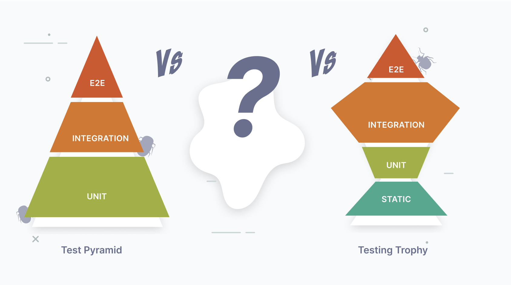
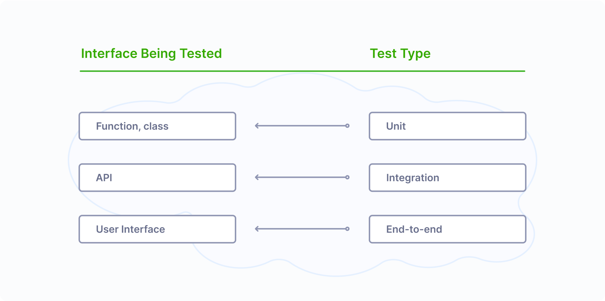
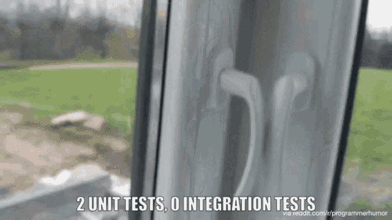
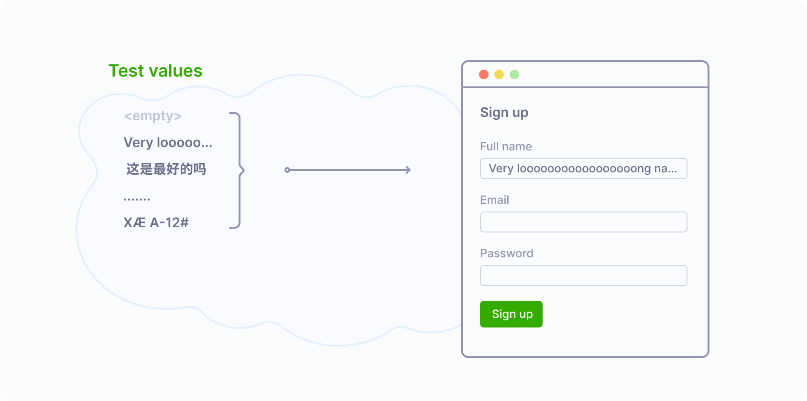
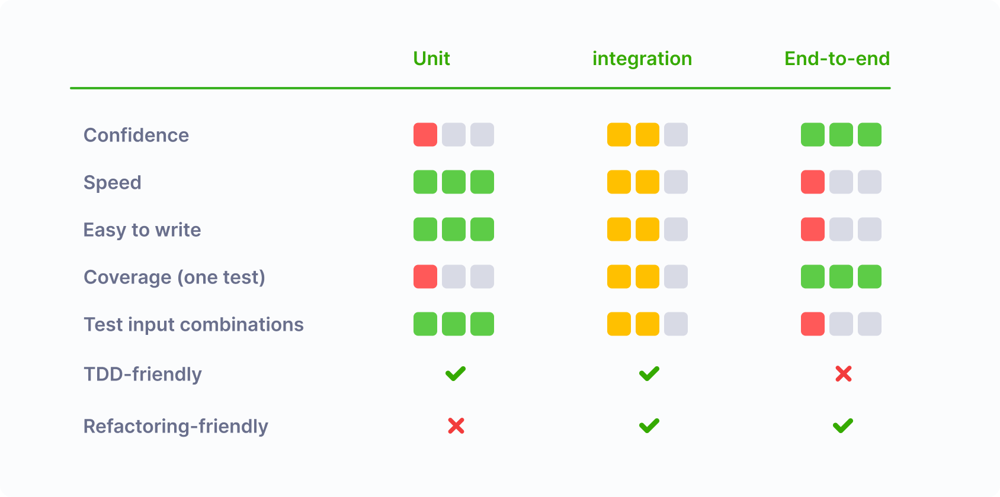
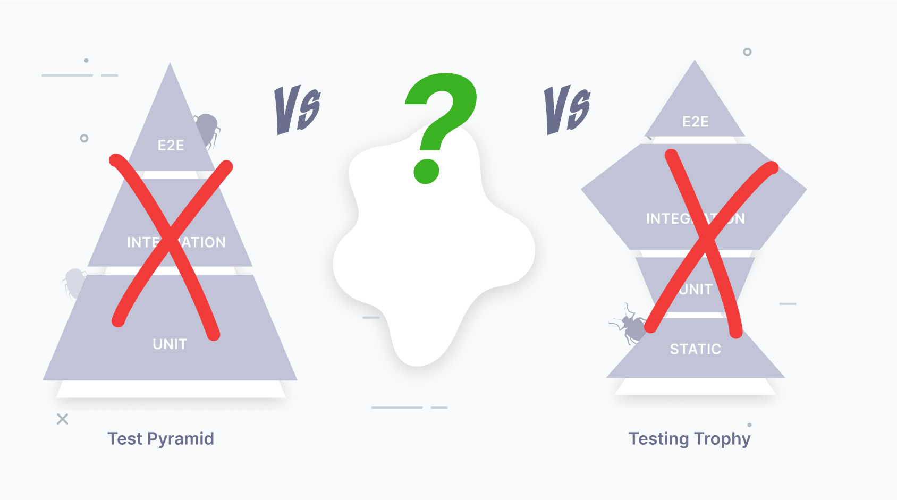
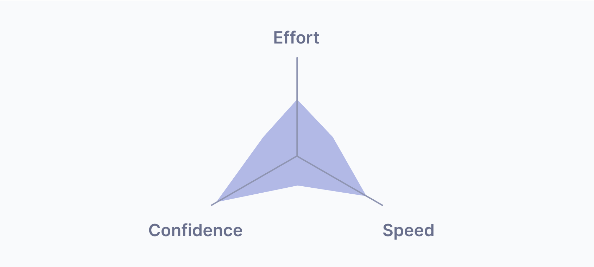
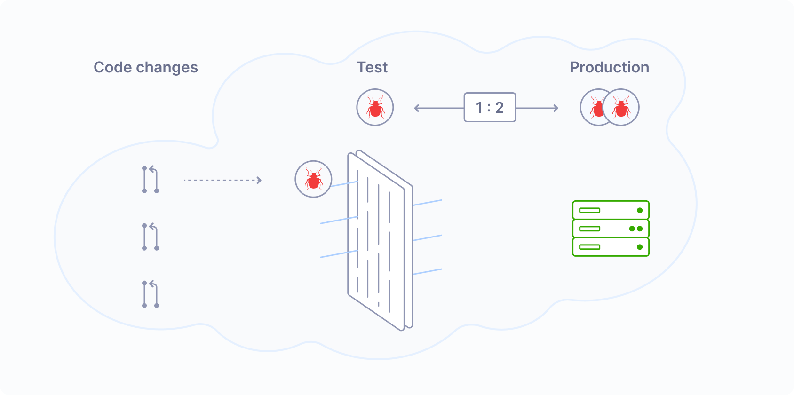
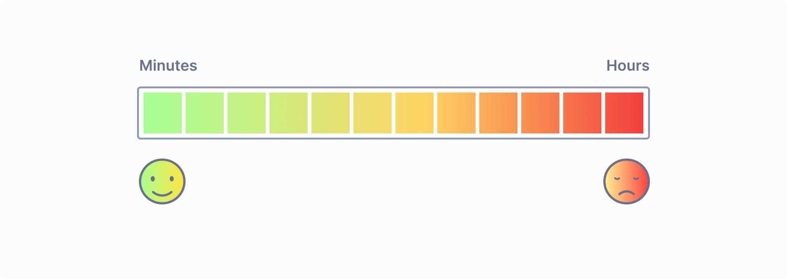
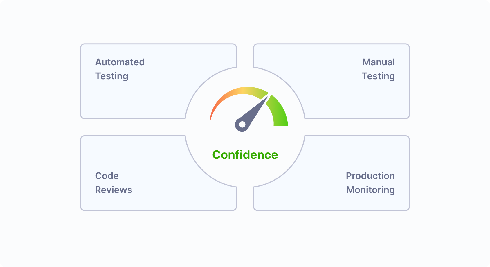



---
If you're interested in automated testing, you might have seen some
contradictory advice. For example, there's a well-known
[Test Pyramid](https://martinfowler.com/articles/practical-test-pyramid.html),
suggesting that we should focus mostly on unit tests. And there's another
approach called [Testing Trophy](https://kentcdodds.com/blog/write-tests),
which suggests that we should mostly write integration tests.

Some posts argue that
[unit tests are overrated](https://tyrrrz.me/blog/unit-testing-is-overrated),
and others - that
[they're fine](https://blog.ploeh.dk/2020/08/17/unit-testing-is-fine/).
Which advice should we follow? Choosing the right testing strategy isn't that
simple, and the choice will have long-lasting consequences. At Ivelum, we've
built and maintained dozens of complex systems, and this post summarizes what
we think about this balance today. Let's dive in.

## Terminology

People most commonly refer to **unit**, **integration**, and **end-to-end**
tests—and those will be the focus of this post. Of course, this isn't the only
way to categorize tests. You might also have come across terms like smoke,
functional, system, or contract tests, each of which serves its own purpose.
To keep things simple, I won't cover every type of test here, but the core
ideas discussed below apply to them as well.

## What is being tested?

Each test interacts with some interface, and the interface being tested defines
the test type:

- **Unit** tests verify the behavior of a small piece of code, such as a
  function or a class;
- **Integration** tests work with larger pieces of code. Often, this is a code
  behind an API;
- **End-to-end** tests work with the program from the end user's perspective by
  interacting with the UI.

## Comparison: Unit - Integration - E2E

Now, let's see how these types of tests compare to each other. Let's start with
the most important which is...

### ✅ Confidence

| 🟥 Unit | 🟨🟨 Integration | 🟩🟩🟩 E2E |
|---------|------------------|-------------|

High-level tests, like integration or end-to-end, provide the best confidence.
Maybe you've seen memes on the internet like this. If all the low-level tests
pass, it doesn't guarantee that our app works as a whole.

Confidence is the most important reason why we even bother with testing. If we
spend time and effort on testing, but the confidence level remains low - it
doesn't seem like a good investment. This is why we list "Confidence" first.
However, it's not the only criterion.

### 🏎️ Speed

| 🟩🟩🟩 Unit | 🟨🟨 Integration | 🟥 E2E |
|-------------|------------------|---------|

The more code under the test, the slower the test is—no surprises here. This
is especially noticeable with end-to-end tests because we run not just one
program but two—our app and another program through which we test. In the case
of web apps, it's a browser managed by a framework like Selenium or Playwright.
As a result, end-to-end tests are the slowest and require more resources like
CPU and memory, and their setup is more complicated.

### ✨Ease of use

| 🟩🟩🟩 Unit | 🟨🟨 Integration | 🟥 E2E |
|-------------|------------------|---------|

Writing and debugging end-to-end tests could be more challenging. The biggest
complaint you may hear is that they're flaky. You run the test once, and it
works. You run it once again, and it fails! Run it one more time, and now it
works again! This problem is so widespread that some people resort to retrying
failing tests automatically, hoping they'll eventually pass.

Why are end-to-end tests flaky? It comes down to how browsers work—handling
network requests, user input, JavaScript, and rendering all at once. If any of
these take a bit longer, it can cause unexpected timing issues or transient
states that throw off the test. A well-written test accounts for this by
checking intermediate states and waiting for elements to load, making it
stable and reliable. But simpler tests often skip these steps. They usually
work—but sometimes fail without clear reasons. That's why flaky tests are
common: writing them properly is just more complex.

### 📊 Coverage (one test)

| 🟥 Unit | 🟨🟨 Integration | 🟩🟩🟩 E2E  |
|---------|------------------|--------------|

Unit tests operate on small pieces of code, such as one function or a class, so
one test can cover only so much. Higher-level tests cover larger pieces of code
at a time, which may be helpful when starting with automated testing. If the
codebase has no tests yet, just a few end-to-end or integration tests may
quickly provide decent coverage.

I don't think chasing a very high percentage of coverage makes sense, though.
As coverage grows, it becomes less and less useful as a metric, and 100%
coverage won't guarantee the absence of bugs. However, going from 0% to 50-70%
would certainly make a difference.

### 🔀 Testing input combinations

| 🟩🟩🟩 Unit | 🟨🟨 Integration | 🟥 E2E |
|-------------|------------------|---------|

In theory, we could use any test type to validate all desired input
combinations. In practice though, it could be painful to do with slow running
tests.

Let's say we have a sign-up form that accepts a user's name, email, and
password, and we would like to test five input combinations for each field. It
may include a very long name, names in different languages, an already existing
email, a password that is too short or appears in a leaked password database,
etc. Testing all 5 x 3 = 15 combinations with end-to-end tests will take
significant time. And this time quickly adds up! If we test all input
combinations in the app this way, end-to-end tests will run forever.

Instead, we could use a hybrid approach. It would be enough to test just two
combinations with an end-to-end test: a happy path and when an error occurs.
Then, we could cover the rest of the combinations with unit or integration
tests, which would work much faster, and with a couple of E2E tests covering
our back, there will be no degradation in confidence.

### 🤝 TDD-friendly

| ✅ Unit | ✅ Integration | ❌ E2E |
|---------|----------------|-------|

While it is technically possible to use TDD with any test type, I'd argue that
it doesn't play well with end-to-end tests due to their slowness. When using
TDD, people tend to run tests often, and if they are slow, it would be too
painful to build the program this way.

I'm not saying that we should always use test-driven development, though. As
with any technique, it has limitations and works great in some situations and
not so great in others. I'm just saying that it's much easier and more
enjoyable to use TDD with fast tests.

### ♻️ Refactoring-friendly

| ❌ Unit | ✅ Integration | ✅ E2E |
|---------|----------------|-------|

By definition, refactoring means restructuring the code without adding new
features. Restructuring the code, in turn, means that the internal interfaces
in the code might change—we might add or remove functions or classes or change
their call signatures.

This process slows down significantly if these functions or classes are heavily
covered with unit tests, which is often the case in projects that meticulously
follow the Test Pyramid.

Conversely, high-level tests can significantly boost refactoring speed since
they provide a quick way to verify that the program works as before from the
end user's perspective.

## Side-by-side

## So what should we use?

Looking at the table above, we see no clear winner. Integration tests may look
more balanced (and I like them), but they're not a silver bullet and aren't the
best for every situation. So the answer is good old "It depends." Yes, boring,
but true.

I think methodologies like Test Pyramid or Testing Trophy do more harm than
good. Their original explanations are rational and nuanced, but their most
memorable artifact is the simple picture that clearly shows the "default" test
type—unit, in the case of Test Pyramid, or integration, in the case of Testing
Trophy. Most people remember only this.

When developers adopt one of these methodologies, they often just go with the
"default" test type if they don't immediately see reasons not to use it. This
is a mental shortcut. It requires less thinking but results in suboptimal
testing suites - less robust, more complex, or slower than they could be.

## A better target

Instead of focusing on specific test types, we'd better focus on values: What
do we like to achieve with testing?

We certainly want **Confidence**—it's the primary reason why we even bother
with testing. We also want **Speed**; the faster our tests are, the better.
And it all comes with a price, and the price is **Effort**. Our users don't
care about our test suite; they care about features. Kent Beck, the author of
TDD, summarized it perfectly:

> My philosophy is to test as little as possible to reach a given level of
> confidence.

I think this diagram of balancing confidence, speed, and effort is a much more
useful concept to remember than any methodology based on balancing different
test types.

## How to find the right balance?

We probably can't measure this balance precisely, but we can develop some
intuition about good and bad for each axis.

### ✅ Confidence as a measure of bugs filtering efficiency

Our test suite works like a filter between our code and production, catching
bugs. The efficiency of this filter is a measure of confidence. If our tests
never fail, the filter is useless—it doesn't catch anything. By looking at bugs
caught by tests and bugs sneaking into production, we can get an idea of how
efficient the filter is and what level of confidence we get from tests.

### 🏎️ Speed: What is fast and slow?

How long does it take to run the full test suite when pushing a change to
production? If it's measured in minutes, excellent! If it takes hours, that's
too bad, and there's a grayscale in between.

A common trick to speed it up is to run tests in parallel. A multi-threaded
test runner and a powerful server might be enough for a small project. For
large projects, it may require a significant investment. For example, Stripe,
in its [annual letter](https://stripe.com/annual-updates/2022), mentions its
test infrastructure as its largest distributed system:

> The biggest distributed system at Stripe is our testing system. Stripe now
> comprises more than 50 million lines of code. Each change is verified within
> 15 minutes by running a battery of tests that would take 50 days to run on a
> single CPU.

### 🧭 Guiding our effort

No matter how good our test suite is, it must never be the only way of
achieving production stability. If we do automated testing, that's great, but
it doesn't mean we can abandon manual exploratory testing. It doesn't mean we
can get rid of code reviews or that there's no need for production monitoring.
All these measures are essential and complement each other to give us the level
of confidence we need.

When a production incident occurs, we should track its root cause and ask
ourselves: How could it be prevented? Sometimes, the answer is "write a test,"
but not always. It could also be improving processes, monitoring, or something
else. This will guide our efforts.

## Bottom line

Don't chase that magical test proportion - it doesn't make sense. Better look
at how you could test this particular feature with good confidence, minimal
effort, and reasonable speed, and don't hesitate to use whatever kinds of tests
if they fit the job.

And if you're looking for a development partner that combines confidence,
speed, and pragmatism—[Let's talk](https://ivelum.com/contact/#talk)!
