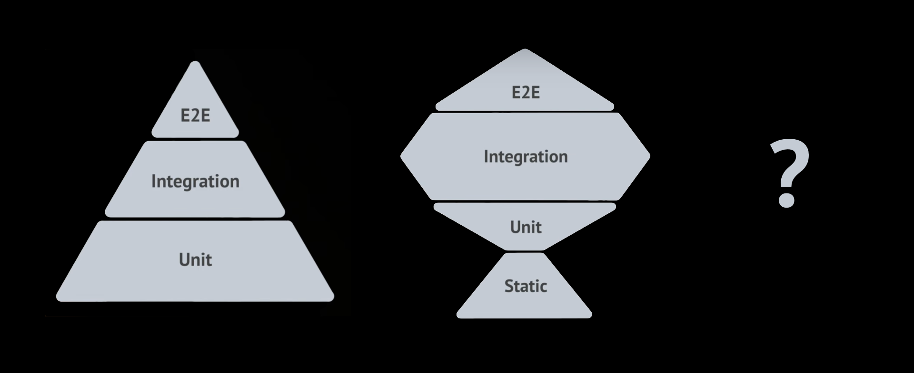
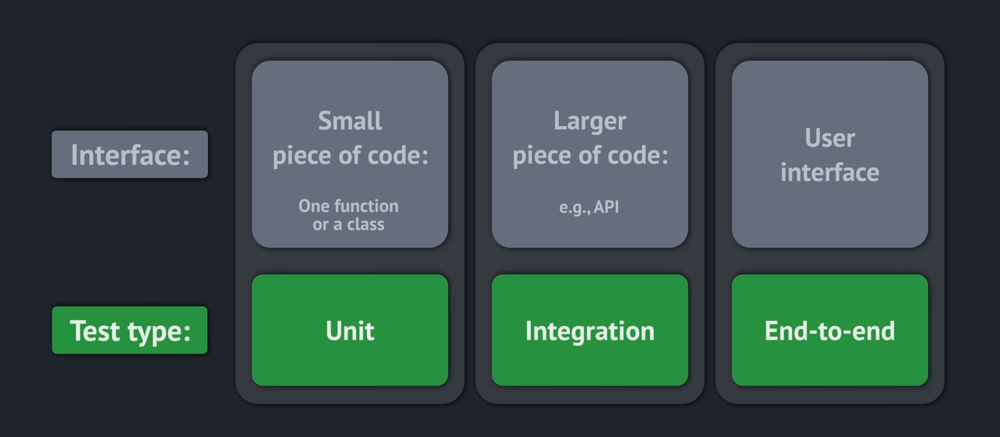
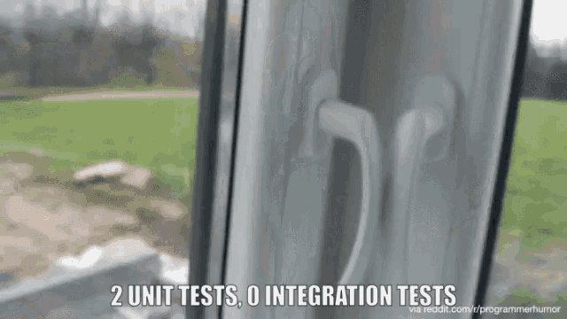
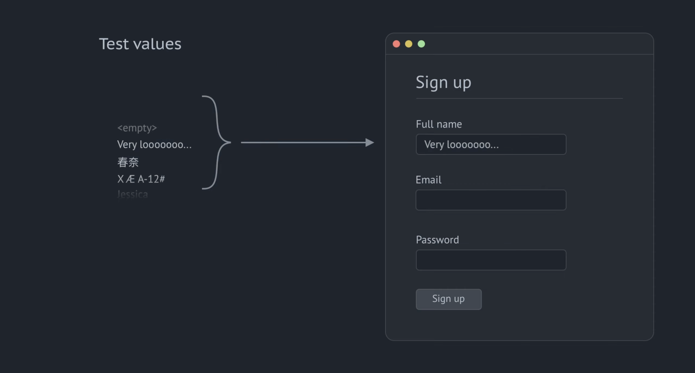
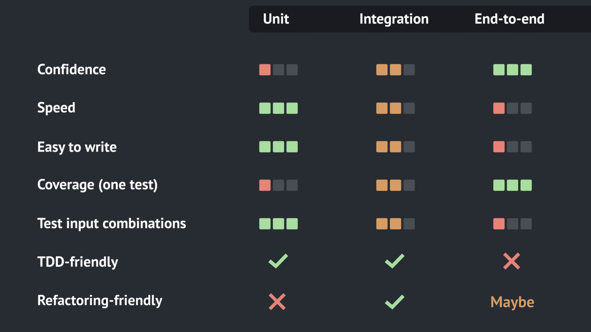



---

If you're interested in automated testing, you might have seen some
contradictory advice. For example, there's a well-known
[Test Pyramid](https://martinfowler.com/articles/practical-test-pyramid.html),
suggesting that we should focus mostly on unit tests. And this is another
approach called [Testing Trophy](https://kentcdodds.com/blog/write-tests),
which suggests that we should mostly write integration tests. Some posts argue
that [unit tests are overrated](https://tyrrrz.me/blog/unit-testing-is-overrated),
and others - that
[they're fine](https://blog.ploeh.dk/2020/08/17/unit-testing-is-fine/). Which
advice should we follow? Let's dive in.

## Interfaces being tested

People most commonly refer to **unit**, **integration**, and **end-to-end**
tests—and those will be the focus of this post. That said, this isn't the only
way to categorize tests. You might also have come across terms like smoke,
functional, system, or contract tests, each of which serves its own purpose.
To keep things simple, I won’t cover every type of test here, but the core
ideas discussed below apply to them as well.

So what's the difference between different test types? It starts from the
interfaces being tested:

- **UI** - the User Interface through which people can interact with the app;
- **API** - Application Programming Interface. It could be an internal API, for
  example for communication between the backend and the frontend, or external
  APIs for integration with other systems;
- **Internal interfaces** in the code, defined functions, classes, and modules.
  For example, a function call signature is also an interface, defined by the
  parameters accepted by the function and the type of value it returns.

Each test interacts with some interface, and the interface being tested defines
the test type:

## Comparison: Unit - Integration - E2E

Now, let's see how these types of tests compare to each other. Let's start with
the most important which is...

### ✅ Confidence

High-level tests, like integration or end-to-end, provide the best confidence.
Maybe you've seen memes on the internet like this. If all the low-level tests
pass, it doesn't guarantee that our app works as a whole.

End-to-end tests verify the program behavior from the end user perspective,
providing the best confidence that it's actually working.

Confidence is the most important reason why we even bother with testing. If we
spend time and effort on testing, but the confidence level remains low - it
doesn't seem like a good investment. This is why we list "Confidence" first.
However, it's not the only criterion.

### 🏎️ Speed

It typically follows this pattern: Unit → Integration → E2E, with unit tests
being the fastest, end-to-end being the slowest, and integration somewhere in
between.

End-to-end tests are slow because we have to launch not just our app as a whole
but also another app through which we will emulate user actions. For web
applications, it would be a browser managed by a testing framework like
Selenium or Playwright. Besides being the slowest, such tests also require more
resources, like CPU and memory, and their setup process is more complicated.

### ✨Ease of use

Writing and debugging end-to-end tests could be more challenging. The biggest
complaint you may hear is that they're flaky. You run the test once, and it
works. You run it once again, and it fails! Run it one more time, and now it
works again! This problem is so widespread that some people resort to retrying
failing tests automatically, hoping they'll eventually pass.

Why are end-to-end tests flaky? It comes down to how browsers work—handling
network requests, user input, JavaScript, and rendering all at once. If any of
these take a bit longer, it can cause unexpected timing issues or transient
states that throw off the test. A well-written test accounts for this by
checking intermediate states and waiting for elements to load, making it
stable and reliable. But simpler tests often skip these steps. They usually
work—but sometimes fail without clear reasons. That’s why flaky tests are
common: writing them properly is just more complex.

### 📊 Coverage (one test)

Unit tests test small pieces of code, such as one function or a class, so they
can cover only so much at a time. Higher level tests cover larger pieces of
code at a time, which may come handy when we are just starting with automated
testing. If the codebase has no tests yet, just a few end-to-end tests may
quickly provide a decent coverage.

It's important to keep in mind that chasing a high percentage of test coverage
might not be worth the effort. Coverage can be a misleading metric. Even if we
achieve 100% coverage, it doesn't guarantee the absence of bugs. It simply
means that every line of code has been executed during testing with at least
one combination of input parameters. However, the total number of possible
input combinations can be astronomically large. Testing all of them is clearly
unfeasible, but testing some can be highly valuable. To build confidence in our
code, we often need to run the same code multiple times with varying inputs,
rather than relying on a single test run.

### 🔀 Testing input combinations

In theory, we could use any test type to validate all desired input
combinations. In practice though, it could be painful to do with slow running
tests.

For example, let's say we have a sign-up form that accepts a user's name,
email, and password. It doesn't make sense to try all possible and impossible
human names. But trying an empty string, a very long name, names in different
languages, or special characters makes sense. We may also want to check what
happens if an email already exists, is not in a valid format, or if the
password is too short or appears in a leaked password database.

To test this form properly, we should run the test not just once but multiple times, trying different input parameters. Unfortunately, end-to-end tests don't handle this very well due to their slowness. If we want to test five different inputs for each field on this form, we'll have to run the test at least fifteen times, which will take a while. And this is just one simple form! How long will it take to test the whole application this way? Testing speed matters, so let's see how to do it more efficiently.

Looking inside the app, we'll see that the front end doesn't contain too much logic for this form. It only takes input parameters, passes them to the API, and shows errors returned by the API or lets users in if they signed up successfully. All validation logic happens on the backend, where we can see separate functions that validate each input parameter. It's probably unnecessary to test all of this chain for each combination.

We can write just two end-to-end tests for the cases when sign up succeeds and when it fails. Additionally, we can cover input validation functions with unit tests, which will work much faster and test the required combinations almost instantly. This hybrid approach will work several times faster than pure end-to-end testing, giving us nearly the same confidence.

### 🤝 TDD compatibility

While it is technically possible to use TDD with any test type, I'd argue that
it doesn't play well with end-to-end tests due to their slowness. When using
TDD, people tend to run tests often, and if they are slow, it would be too
painful to build the program this way.

I'm not saying that we should always use test-driven development, though. As
with any technique, it has limitations and works great in some situations and
not so great in others. I'm just saying that it's much easier and more
enjoyable to use TDD with fast tests.

### ♻️ Refactoring

The last item in this comparison is refactoring. Remember, in the beginning, we discussed that each test interacts with an interface. These interfaces may change over time. New functionality would likely appear in the user interface. Sometimes, we may even want to redesign it. It probably won't happen too often because we don't want to frustrate our users, but it may happen. APIs tend to be more stable, especially public APIs. Third-party services or libraries usually care about backward compatibility. They may add new features but usually don't break things without a reason. As for the internal interfaces, ideally, we should have the freedom to modify them as we want if it doesn't break the program for end users.

This is where unit tests may become a problem, especially in projects where people meticulously follow the Test Pyramid. Modifying the code would require changing or rewriting the unit tests as well, and sometimes, the effort is so high that developers simply give up. On the other hand, integration tests and end-to-end tests make refactoring easier because these interfaces aren't supposed to change. We just run these tests and quickly verify that the refactored code works.

Now, let's answer the question - which test strategy is the best? Should we follow the Test Pyramid, the Testing Trophy, or maybe something else? I would argue that none of these, and this is a misleading target. The real values that we should balance are confidence, testing speed, and effort. Confidence is the only reason why we test in the first place. Effort is the price we pay; the less effort we spend, the better. Kent Beck, the author of test-driven development, said, “My philosophy is to test as little as possible to reach a given level of confidence.”

The third crucial component is speed. A good indicator is how long our test suite runs when we push an update to production. If it only takes a few minutes - excellent! But on some projects, it takes many hours, and that's a serious problem. It slows down the development process and represents an elevated risk because people may skip running all tests for urgent fixes.

A common way of improving speed is to run tests in parallel. Enabling a multi-threaded test runner might be enough for a small project. For large projects, it may require a significant investment. For example, Stripe, in its annual letter, names testing infrastructure as its largest distributed system. The Stripe codebase has 50 million lines of code, and they manage to test changes in it in under 15 minutes, which is impressive.

So, what tests should we focus on? I think we should start with high-level tests, integration, or end-to-end because they provide a good level of confidence and make refactoring easy. However, it might be impractical to test all corner cases with these tests due to their slowness, and here, unit tests come to the rescue. Will it result in the Testing Trophy, Test Pyramid, or another proportion? I don't know; it depends on the project, and actually it doesn't matter. What matters is that we are happy with the balance of confidence, speed, and effort.

We probably can't measure this balance, but I'd like to give you a few ideas of how you can think of it, starting with confidence. Tests are like a bug filter between our codebase and production. If our tests never fail, it means that we never make mistakes, which is unlikely, or the tests are useless - they don't catch anything! By looking at bugs caught by tests and bugs in production, we can get an idea of our confidence level from tests.

As for the speed, see how quickly the tests run when we push an update to production. A few minutes is great, and many hours is terrible, and there's a grayscale in between. And effort. I think it's important to remember that automated testing should never be the only thing we do to keep our production stable. If we write tests, it's great, but we still need to do manual testing to discover previously unknown bugs. We should also be doing code reviews and have robust production monitoring. All these measures work together and contribute to production stability. By looking at production incidents, we can analyze why they happen and which of these tools might address the issue more efficiently. This would guide our effort.

And that's all I have for today! Don't chase those magical tests proportion - it doesn't make sense. Better look at how you could test this particular feature with good confidence, minimal effort, and reasonable speed, and don't hesitate to use whatever kinds of tests if they fit the job. Happy testing!
