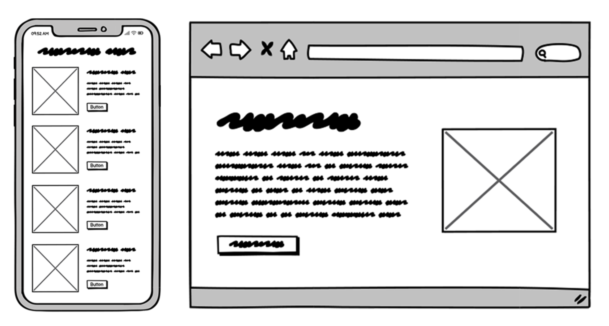
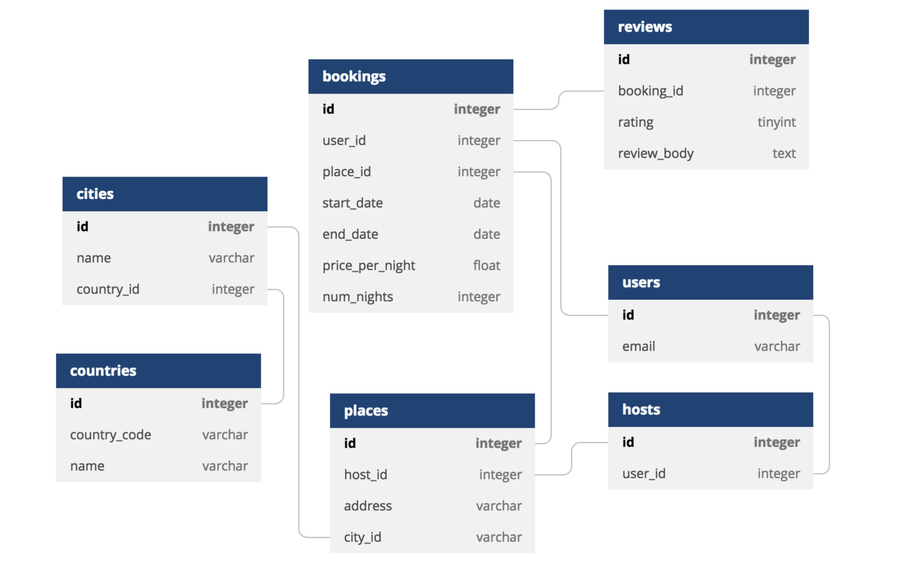

Once you decide which feature you want to build, it's time to decide how to
actually build it. Over the years, I have participated in dozens of software
development projects as a developer and engineering manager. I have built many
features myself and have been lucky to collaborate with many talented people
and watch how they work.

Below is my go-to checklist for starting work on a new feature. It's based on my
experience and the teams I supervised – what worked well, and if problems arise,
where did they stem from? Of course, the approach I propose here might not fit
every situation. However, so many problems in my practice fall into these three
buckets that I thought it was worth treating them as a checklist:

## #1: Understand "why"

- Who will be using this feature?
- What problem are we trying to solve for them?
- Why are we going to solve it this way?

Sometimes, developers skip these fundamental questions and jump right into the
code. It's understandable. They're eager to do what they love, and also, isn't
it the product manager's job to think about such questions? Well, yes, it
certainly is; but that doesn't mean this information is useless for us
developers.

While working on a feature, we face many decisions on all levels, from "How do
I name this variable?" to "We ran into a technical issue and need to find a
workaround." A deep understanding of the task context is crucial for making
informed decisions. It's also worth thinking a bit ahead:

- How may this functionality evolve in the future?
- How much data may we need to store?
- Which system failures will cause a bad user experience, and how will we
  handle that?
- ... and so on.

The answers to these and similar questions make the difference between great
and poorly designed software. And, once again, we need to understand the task
context to get it right.

In an ideal world, the answers to the most important questions will be found or
inferred from the task description itself: who the users of this feature are,
what problem we will be solving, and why we are going to solve it this way.
In practice, this is not always the case, and sometimes developers are shy
about asking or think it's none of their business. Please don't skip this step.
Not only will it help you solve this particular problem at hand better, but
it's also essential for your professional growth.

## #2: UX design

Regardless of the interface you're building — a UI, API, or command line —
consider the user interface carefully before jumping to writing code.

If someone else has already prepared the designs, that's awesome; so, study
them thoroughly first. You might spot problems or inconsistencies and will be
able to report them to the designer early on. Even if everything is clear and
reasonable, it's still time well spent because now you have a much better
understanding of what you're building.

If there are no designs yet, and you're supposed to come up with something,
make sure to work on the designs before the code! Some developers, when
tasked with building a UI, tend to postpone it because they're not so
confident about their design skills and prefer to start with something else –
something they're more familiar with. Don't do that. Understanding how users
will interact with the system should be your top priority. It'll likely save
you a lot of development work time, and the result will be much better.

You can still produce something useful even if you're not a professional
designer. For example, you can use a rapid wireframing tool like
[Balsamiq](https://balsamiq.com) (my favorite) or
[Excalidraw](https://excalidraw.com). With such tools, you can sketch an idea
quickly without spending time on minor visual details. Or, use a whiteboard or
good old pencil and paper. Any sketch is better than nothing.

*Low-fidelity [Balsamiq](https://balsamiq.com) wireframes*

And if you're building an API or a command-line interface, your design would be
the documentation and usage examples. It doesn't have to be polished at this
stage but should include at least the most important use cases.

## #3 - Data structures

> "Bad programmers worry about the code. Good programmers worry about data
> structures and their relationships." - Linus Torvalds.

> "Smart data structures and dumb code works a lot better than the other way
> around." - Eric S. Raymond.

Yes, data structures are important. Depending on the task, we may optimize them
for data consistency, speed, storage requirements, and developer experience;
and how we organize data may have vast implications in all of these dimensions.
However, the reason why they're on my list is something else:

**Data structures are harder to change.** If we modify a data structure, we'll
have to update all the code that works with it and also migrate the existing
data to the new structure, which can be quite a challenge depending on the
project stage and size. As a result, data structures often live longer than the
original code that was shipped with them. Also, building more features on top
of existing data structures is quite common, so it makes sense to try to make
them future-proof to some degree.

This is why data structures are #3 on my list. After we study the task context
and understand how users will interact with the system, this is the next
important thing to tackle. We can certainly revise data structures later while
working on a feature, maybe even multiple times, but given their importance and
potentially problematic updates, we should start working on them as early as
possible in the process.

If the project is based on a relational database and the feature you're working
on uses multiple tables, it might be a good idea to visualize it using an ER
diagram. ER diagrams are arguably the most useful part of the UML
specification. You may skip everything else in UML, but if you're working with
relational databases, don't skip ER diagrams :)

*Credit: [dbdiagram.io](https://dbdiagram.io)*

## Summary

When you start working on a new feature:

1. Understand "why";
2. Review UX designs or create your own;
3. Design data structures;
4. Code.

In that order.
