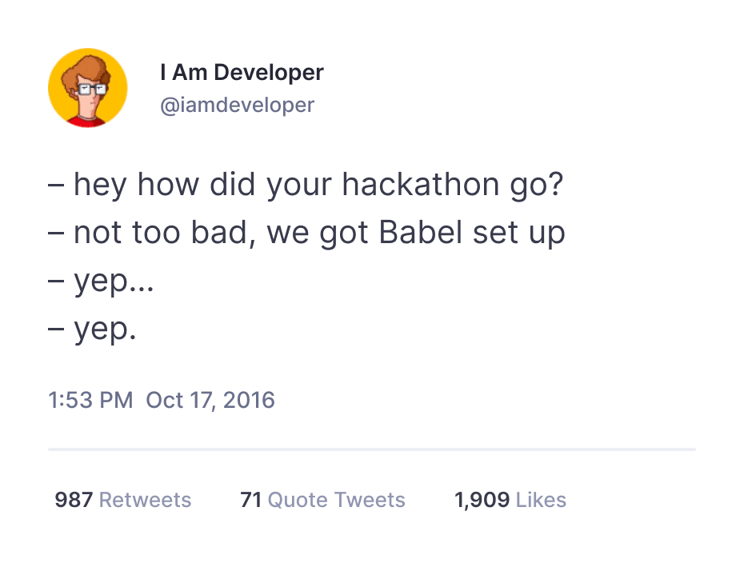

This post is not just another take on the never-ending "generalists vs.
specialists" debate. We'll be looking at one specific area – web development.
We won't be talking about mobile apps, machine learning, game development,
and whatever else is on the horizon; this post is about web development only.
So let's start with a brief history of how it evolved in the last two decades.

In the early 2000-s, when the web was young, the distinction between frontend
and backend developers barely existed. Browsers were not as powerful as today,
and websites looked much simpler. Some people specialized in working with
HTML/CSS, but that was a bit different – HTML is a markup language, not a
programming language. The industry was already pretty active, though. PHP,
Java, Ruby, JavaScript, CSS, MySQL, and Postgres were all introduced in
1995-1996, and we still use these technologies today. By 2000, developers had
already built enough websites to
[crash the stock market](https://en.wikipedia.org/wiki/Dot-com_bubble), even
without jQuery! But that was going to change.

## [2010-s: The rise of frontend frameworks](#2010-s-the-rise-of-frontend-frameworks){#2010-s-the-rise-of-frontend-frameworks}

The major shift happened somewhere in the 2010-s when frontend frameworks
emerged. A remarkable demonstration of what they made possible is Trello,
a popular issue tracker released in 2011. It was built on the Backbone.js
framework, which was cutting-edge technology at the time. Since Trello used
the Single Page Application (SPA) architecture, it didn't require a full page
reload to interact with the server. And it felt fast! Trello was very popular,
thanks to its good design and a generous free plan, so many people tried it
and are still using it.

Trello wasn't the very first SPA, of course. Another famous example is GMail
which was introduced in 2004. However, Trello was built on a frontend
framework, and frontend frameworks promised to do a significant amount of heavy
lifting for you. It was around early 2010-s when frontend frameworks really
started to take off: Backbone and Angular.js were released in 2010, Ember.js
in 2011, React.js in 2013, and so on.

I'm not sure if it was pure coincidence or a result of Trello's popularity, but
at that time [TODO list](https://todomvc.com/) had become a canonical example,
showcasing the capabilities of JS frameworks.

## [APIs](#apis){#apis}

Simultaneously in the 2010-s there was an explosive growth of APIs:

*Source: [Programmable Web](https://www.programmableweb.com/news/apis-show-faster-growth-rate-2019-previous-years/research/2019/07/17)*

Many organizations realized that building APIs could be a way to save
development efforts and move faster. The same API can be behind a web
application and a mobile app, and when needed, it can be exposed outside and
used by external integrations. Widespread adoption of the REST API concept has
further boosted the API development.

## [Frontend developers](#frontend-developers){#frontend-developers}

Frontend frameworks were hot in the 2010-s. People were talking about them at
conferences. At that time, the joke about "X days without a new JavaScript
framework" wasn't so much of a joke.

Some web developers were excited about these innovations, but others... not so
much. Previously, CSS and JavaScript were already perceived by many as a mess.
Browsers were not very compatible with each other, so numerous CSS and
JavaScript hacks were required to get things working consistently in all
browsers. Now, another layer of complexity had been added – frontend frameworks,
JS bundlers, and package managers, and they were young and still in flux.

And so, some developers started to specialize in this area and call themselves
frontend developers. It seemed reasonable because the industry was moving
rapidly. All that additional complexity required additional time to study, and
developers were always in demand. Many "traditional" web developers converted
to backend developers and were glad they wouldn't have to deal with that
ever-changing frontend mess.

APIs became a natural separation of responsibility between the backend and
frontend. Backend developers would build an API, and frontend developers would
build a web application on top of it.

The separation of backend and frontend roles provides two major benefits:

1. **Hiring becomes easier.** Since the scope of required knowledge for each
   role has been reduced, it would take less time to become a qualified
   developer. Besides, such a separation allows people to choose an area they
   like more. Some folks enjoy working with interfaces, and others prefer the
   backend world with databases and algorithms.
2. **It allows deeper specialization.** Again, because of the more reduced
   scope, people would become experts in their areas faster.

Some people would argue that there are additional benefits of faster and/or
better quality development due to higher specialization, but it's not always
the case. It could be true for some projects and false for others due to the
reasons outlined in the next section.

## [What problems do full-stack developers solve](#what-problems-do-full-stack-developers-solve){#what-problems-do-full-stack-developers-solve}

Not everyone has hopped on that backend-frontend separation train, though.
Simultaneously with frontend developers, a competing role emerged – full-stack
developers. They were specifically required to work with both the backend and
frontend, like in the good old days, but with modern technologies. Facebook is
a notorious example – there was a time when they proudly stated that they hired
full-stack developers only. You can also find full-stack positions in Google,
Netflix, and many other reputable organizations.

Why hasn't everyone embraced that frontend-backend role separation? Well,
because it isn't free. Besides the benefits mentioned above, there are some
issues, most notably:

**Extra dependencies to manage.** Backend and frontend separation has
introduced a dependency. Frontend developers rely on an API but cannot build
it themselves. As a result, they need to talk to backend developers first,
agree on the API design, and then wait until backend developers implement it.
If they don't have other tasks to work on while waiting, they can build an API
mock, work with it in the meantime, and then replace it with a real API. If
later they discover that something is missing in the API or it doesn't work
as expected, they need to talk to backend developers again and then wait for
an update or fix.

**Mediocre APIs** often emerge as a result of such separation. Sometimes,
frontend developers can see that the API they're using is not perfect, but at
the same time, they can work around it with some hacks. Of course, ideally,
they should report it to backend developers and suggest improvements, but that
entails some friction, so issues often end up being neglected. For backend
developers, it could be harder to see usability problems with their APIs
because of a lack of "dogfooding" – they don't use what they build themselves.

**Workload distribution problems,** especially in smaller teams. It's much
easier to prioritize work in a team of full-stack developers because all of
them can work on any task. The percentage of the backend-vs-frontend work
during the project's life may vary. With dedicated backend and frontend
developers, their workload is often suboptimal. Frontend developers could be
overloaded with high-priority tasks, and backend developers cannot help them,
and vice versa.

**Some technologies cross boundaries.** Let's take Server Side Rendering (SSR),
for example. With SSR, the same code is executed on the server side and then in
the browser. Technically, it is closer to the frontend since it mentions the
frameworks that frontend developers are typically using. However, frontend
developers would no longer be in their traditional territory – they would be
running their code on a server. Another example is Hotwire for Ruby on Rails
which was introduced in 2021. This takes an alternative approach, suggesting
adding interactivity to web pages without traditional SPAs and APIs.
WebAssembly is another interesting technology for high-performance code that
can run on both server and client.

**Lack of product thinking.** Since full-stack developers work on all aspects
of a task, they tend to understand better the big picture of what they're
building. Frontend developers see how people would interact with software, but
they may have a vague understanding of its internals. Therefore, it may be hard
for them to decide what would be easy to build and what is challenging, and
which optimizations are possible. On the other hand, backend developers
understand the internals very well, but they may not look at the product from
the end user's perspective.

## [State of modern frontend](#state-of-modern-frontend){#state-of-modern-frontend}

What has changed in frontend development since the 2010-s? Well, many things,
but most importantly – it has matured:

- New frontend frameworks no longer appear every other day. The innovation in
  this area continues, but it's no longer a crazy ride like in the 2010-s;
- Browsers have improved! We no longer need that ridiculous amount of CSS hacks
  in our codebase. Flexbox and Grid layouts are now safe to use for most apps,
  so we can finally center a div.
- JavaScript has improved, and it's not just
  [leftpad](https://qz.com/646467/how-one-programmer-broke-the-internet-by-deleting-a-tiny-piece-of-code)
  being [accepted as a standard](https://developer.mozilla.org/en-US/docs/Web/JavaScript/Reference/Global_Objects/String/padStart).
  There have been numerous improvements in the language, tooling, frameworks,
  libraries, package managers, bundlers, linters, and testing tools. And it's
  no longer considered a slow language – it's faster than some popular
  languages used on the backend, such as Python or Ruby;
- TypeScript is now the standard de-facto for those who prefer stronger typing.

This is not to say that all problems on the frontend are solved, but today it's
much easier to work with it than ten years ago. Yes, a large portion of
complexity is still there, but it's no longer such a mess, so there are fewer
reasons for backend developers to hate it.

## [Should you hire full-stack developers?](#should-you-hire-full-stack-developers){#should-you-hire-full-stack-developers}

It depends. There could be no benefit from full-stack developers in areas of
your project with little or no back-and-forth between the backend and frontend.
Hiring dedicated backend or frontend developers is easier, and it matters.

However, if interactions between the backend and frontend happen regularly,
and most tasks require working on both parts – then maybe consider hiring at
least some full-stack developers. Hiring would be more difficult, but it's
certainly doable. I know it first-hand since we've been hiring full-stack
developers at ivelum for years. If you don't take it from me, take it from
Google, Meta, Netflix, and others. High-qualified full-stack developers do
exist, and it is possible to find them.

You can also have a hybrid team – some frontend and backend developers and
some full-stack folks to take the best from both worlds.

## [Should you become a full-stack developer?](#should-you-become-a-full-stack-developer){#should-you-become-a-full-stack-developer}

When you read these lines, I bet you already know the answer. It's perfectly
fine if you don't want it – specialization is nothing wrong. Most job offers
nowadays are for frontend or backend developers, and it's very unlikely that
it'll change anytime soon.

If you'd like to give it a try, then go ahead! Even if you are not going to
apply for a full-stack position, a better understanding of what happens on the
other side will help you to see the big picture and be a more productive
collaborator. And if you really invest in it, you'll be able to apply for a
broader range of jobs and build complete features from start to finish.

Here are a couple of random thoughts on this topic:

- For backend developers, it might be easier to switch to full-stack
  development. The scope of additional knowledge required is significant but
  smaller than for the other side;
- For frontend developers, trying Node.js might be enticing. There are many
  things to learn on the backend, and with Node, you won't have to start by
  learning a new programming language.

And that's all I have for today. Happy coding!
