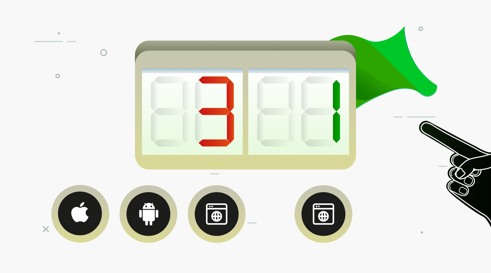
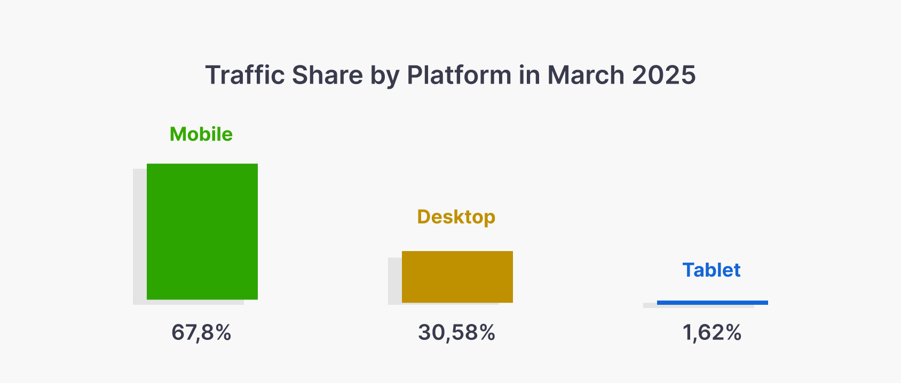
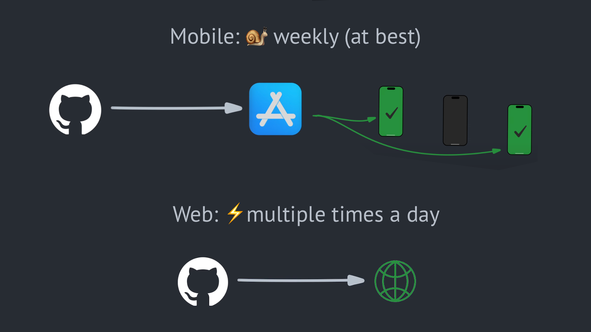



---

We at ivelum work with startups a lot, and sometimes we meet startup founders
who want to build a mobile app. While it may be justified in some situations,
more often than not, it's a risky choice. We think most startups should build
their MVP as a web app. Let's dive in.

We'll compare the development speed, technology capabilities, user experience,
and take a quick look from the business perspective. Finally, we'll talk about
situations when you actually should be building a mobile app.

## How many apps do we need to build?

Native development for iOS and Android assumes using different programming
languages, and an app built for one platform won't work on the other. So, to
reach users on both platforms, we'll need to build two apps. There are
frameworks for cross-platform development that make it easier, like React
Native or Flutter, and we recommend considering them. However, even with these
frameworks, there could be differences between the two app versions. Each
platform has its UI guidelines, its ecosystem, and an app store with its
review policies. Being a good citizen means respecting platform rules, which
differ between platforms.

And what about desktop users? If we want to reach them as well, we need to
build… what? Apps for MacOS, Windows, and Linux? It sounds too complicated,
and just a few companies choose this way—most are building a web application
instead. The Web is the most cross-platform technology ever invented. A web app
would work on every desktop operating system, mobile devices, smart TVs, and
even some modern cars, which may also have a web browser.

## People do use websites on mobile, a lot

Some people assume users don’t browse websites from their phones. But they do.
In fact, most of the global web traffic comes from mobile devices:

*Source: [Similarweb](https://www.similarweb.com/platforms/)*

## How quickly can we iterate?

Now, let's take a look at the update process. There are very important
differences between web and mobile. To ship a new version of a mobile app, we
submit it to the app store. A review process may take a few days, and then the
app becomes available. It will be installed automatically for existing users
who have enabled automated updates, probably the next day. But nothing happens
for those who didn't; they continue to run the previous version. In contrast,
a web application is evergreen. When we ship a new version, it almost instantly
applies to all users. There's no review process and no need to ask users to do
anything - they just get a new version all at once.

Statista's report of the Google Play Store app updates shows that
[most mobile apps are updated monthly](https://www.statista.com/statistics/1404434/google-play-store-app-updates-by-frequency/),
and just about a third are updated weekly. We can iterate much faster than that
with a web application—the team can push updates multiple times a day. If we
discover a bug in production, we can deploy a fix within minutes, and all the
users will get the fix at once. With a mobile app, such cadence is impossible.
The fastest release schedule would be once every few days, and even with that,
some users may ignore updates for years. We can ask them to update within the
app, but it adds extra friction for the user and could be annoying. As a result,
we should be very careful when pushing mobile app updates and also care about
API compatibility with old app versions.

## Debugging

Debugging could also be more complicated for mobile. We have to deal with
various operating system versions, screen resolutions, system settings, and
other device-specific behavior, especially on the Android platform. Certain
issues may appear on specific devices only, making investigation difficult.
Similar issues may exist on the web. There is a variety of browsers, and
browser incompatibilities may cause problems. However, the web situation has
improved significantly over the years. Modern browsers are much easier to work
with than, let's say, ten years ago.

## Technical capabilities

We must get something in return for that extra effort and slower development
speed, right? It's more challenging to build mobile apps, but they can probably
do more. Let's explore this in more detail—how mobile apps compare to web apps.

### Launch from the home screen

The most obvious difference for a non-technical user is that mobile apps are on
their phone, meaning they can launch it from the home screen. In contrast, web
apps must be opened in a browser, and they're kind of "temporary"; they don't
"live" on their phone.

Well, this isn't entirely true. Web apps can be added on the home screen,
although many people don't know how to do it. For example, on iOS: Open a
website, tap the Share icon, scroll down, and select Add to Home Screen. Yep,
now it's here. If it's a regular website, it'll open in the browser with no
surprises. However, the website may use Progressive Web Apps technology, which
provides additional capabilities. Look at this. This web app uses the
standalone display mode and opens full-screen without standard browser controls.
Under the hood, it's still the browser, but it looks and feels like a mobile app.

### Working offline

Progressive Web Apps can work offline, just like mobile apps, with the help of
another feature called
[Service Workers](https://developer.mozilla.org/en-US/docs/Web/API/Service_Worker_API/Using_Service_Workers).
It's an optional feature, and developers need to write code to enable it, but
it's pretty much doable if we need to make our app available offline.

### Local storage

Modern web apps can store data directly on the user's device, and it's not just
progressive web apps. There are plenty of options for both regular websites
and PWAs: IndexedDB, Cache Storage, LocalStorage, and SessionStorage.

This means users can return to your app later and still find their data intact,
even if the tab was closed. Storage limits vary by browser, but it's
[usually in gigabytes](https://whatpwacando.today/storage), which is plenty for
typical use cases like user preferences, drafts, or offline content. So,
persistent, local-first web experiences are absolutely doable.

### Sign-in options, biometric auth

Now, let's look at sign-in options. Web and mobile apps have very similar
choices here. We can use email, SMS, sign in with a Google Account, Apple ID,
or Facebook, etc. Besides sign-in, mobile apps can also use biometric
authentication for quick unlock with fingerprint or facial recognition. On
Apple devices, it's Face ID and Touch ID, and there are alternatives on Android.

What some people don't know is that biometric authentication is now available
for web apps, too, through Webauthn standard, although the user experience is
a bit different. Here's a
[demonstration website for this technology](https://webauthn.me). Compared to mobile apps, on the
web, it involves one extra prompt about saving a passkey, and after that, we
can use a fingerprint or face recognition for quick authentication on that
website.

### Payments

Next—payments. Apple Pay and Google Pay are available on the web and mobile,
and the user experience is almost identical. However, commissions could be
very different. On the web, a typical commission for credit card processing
would be around 2-3%. But for mobile apps, both Apple and Google want their
commission for digital products, which could be between 10 and 30 percent,
depending on various factors. It doesn't apply if you're selling physical
goods or services, but for digital products, it could be a deciding factor.

EDIT: In April 2025, there was a court order forcing Apple to
[allow alternative payment options](https://techcrunch.com/2025/04/30/epic-games-just-scored-a-major-win-against-apple/),
which is a huge win for mobile app developers. However, it applies only to the
US App Store; the situation didn't change for users in other locations.
.

### Push notifications

Push notifications are available for both web and mobile. There are many
nuances here, including differences between iOS and Android, and I won't go
into all the details. Just let's make a note that it works here and there, and
the notifications sent from mobile and web look similar. See a
[demo of how it works on the web](https://whatpwacando.today/notifications).

### Geolocation, touch, and multi-touch

We all know that Google Maps is available as a mobile app, but it does have a
web version that works fine on mobile. It can access precise user geolocation
(with their permission, of course), and it supports touch gestures for
navigating the map and multi-touch for zooming in and out.

### Video and sound, camera and microphone, graphics

YouTube works well in a mobile browser, proving that playing video and sound
is possible. It's also possible to access the device's camera and microphone,
with the user's permission, of course. Graphics on the web may work a bit
slower compared to native mobile apps, but with modern technologies like
WebGL is still decent for many applications (see
[demo 1](https://next.junni.co.jp/), [demo 2](https://pad.dotincorp.com/)).
We can even access the device accelerometer from a web app. Look at this
[simple browser game](https://topheman.github.io/bombs/)—you can control
it by tilting your phone.

### Side-by-side

So, to summarize, the gap between web and mobile capabilities certainly exists,
but it may not be as large as you might think. We can add web apps to the home
screen. They can work offline, store data on the user's device, access the
camera and microphone, geolocation, respond to touch and multi-touch gestures,
use biometric authentication, and send push notifications.

## Use cases

To use a mobile app, people first need to install it from the app store, and
then it remains on their phone. Depending on the use case, this could be
beneficial or not.

### Instant messaging: mobile apps

I believe people will strongly prefer a mobile app for instant messaging, such
as WhatsApp or Telegram. While it's technically possible to implement it as a
web app, and, as shown above, even install it on the home screen, enable push
notifications and everything, it would go against user habits because people
are used to thinking about instant messaging as mobile apps. An unusual way of
app distribution might represent extra friction for its adoption.

### Restaurant menu: a web app

In Lithuania, where I live, the [Greet Menu](https://www.greet.menu)
application has taken local restaurants by storm. Many of them now have QR
codes on the tables, and after scanning the code, you can browse the menu or
pay the bill for your table. Similar apps exist in other countries as well.
The Greet Menu app is a web application that opens immediately after scanning
the QR code. It reduces friction for first-time visitors because there’s no
need to install anything, which was probably the key to its success.

### ChatGPT: a web app, and then a mobile app

As of the time of writing this post, the most popular mobile application in the
Apple Store was ChatGPT. However, ChatGPT didn’t start as a mobile app. It
started as a web app that became hugely popular, and then they added a mobile
app. This, in my opinion, represents the optimal path for most new
projects—start as a web app to iterate quickly and prove your idea, and build
mobile apps later when the idea proves to be successful.

## Bottom line

For most startups, a web app is the fastest way to validate the idea and
iterate. Mobile can come later once there's traction.

Some cases do justify starting with mobile, though. If you need low-level
device access, or the best performance possible, or are entering a mobile-first
space like messaging or gaming—your startup could be one of those exceptions.

Need help deciding? [Book a free consultation](/consultation) to discuss your
project idea and get a plan specifically tailored to your needs.
