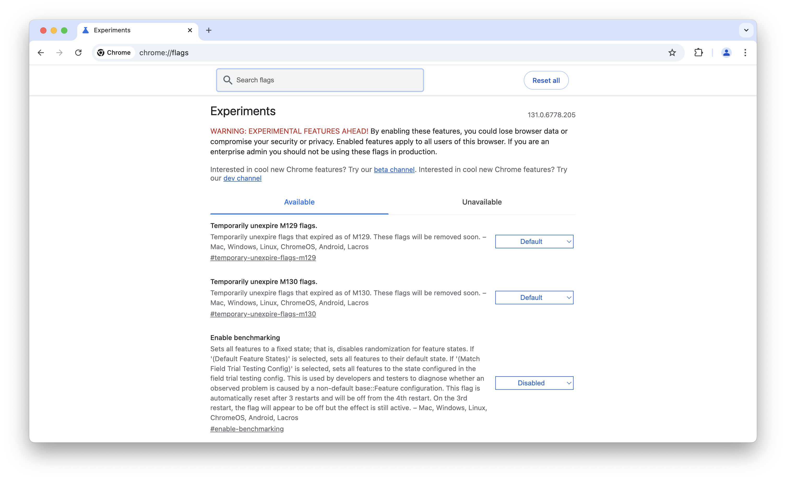

Many engineering teams test new features on staging before pushing them to
production. There’s no doubt that testing is crucial, but is staging really the
best place to test? Let’s dive in.

## What we call a "staging environment"

Staging is a controversial topic among developers. Some argue that it's
essential, others that it's unnecessary, and even the term "staging" is
ambiguous—different people would mean different things. In this post, we'll
call "staging" an application environment that satisfies two criteria:

1. It's a separate environment, which is not a developer environment and not
   production;
2. Developers use this environment to demonstrate their work to others to get
   approval to push it to production.

There could be situations when only one of these criteria is met but not the
other. For example, if developers showcase their work on their machine or in
production, we assume there's no staging since there's no separate environment.
Another example is if a developer has deployed a separate environment to test
something themselves and isn't waiting for anyone's approval. We also assume
this is not a staging environment because "waiting for approval" is crucial to
our definition. Bear with me; you'll see why we use these two criteria soon.

## How staging affects code workflows

Since staging is a separate environment, it makes sense to have a separate code
branch for it. So we'll have at least two long-living branches, probably called
"main" for production and "staging" for staging. Ideally, they both should have
a CI pipeline configured for automated deployments to production and staging.
Developers would start working on new features in separate branches and then
merge them to staging for review:

-- IMAGE --

So what happens next? The review might take some time—maybe a few days or even
weeks. Of course, developers won't waste time simply waiting; they'll work on
something else in the meantime. As a result, having multiple features deployed
to staging is pretty common. Some are pending review, others are actively
developed based on previous feedback, and some features are ready - we have a
green light for deploying them to production.

## Deploying to production... not exactly what we tested!

When a feature is approved for production deployment, developers merge its
feature branch back into the main branch, and it gets deployed to production:

-- IMAGE --

And here's the problem. We tested that feature on the staging environment
**together with other features** that were still on staging but not in
production yet. It shouldn't be an issue if all these features were completely
independent. However, in the real world, dependencies do happen.

As a result, we're deploying a slightly different version of our app to
production—not exactly what we've tested on staging. It does not sound very
reliable, and with active development, we will run into a problem sooner or
later. Could we do a better job?

## What about dedicated feature environments?

Some teams use so-called "feature environments" that usually come with
automation. A special script creates a new clean staging environment for every
pull request so that we can test it separately. The script automatically
deploys all pull request updates to its dedicated environment and cleans up the
environment after the pull request is closed.

-- IMAGE --

This setup is more complicated and requires more resources since we now run
multiple staging environments simultaneously. However, it brings certain
benefits for developers. First, there's no need to merge to the staging branch
anymore, which is faster, and there are fewer code conflicts to resolve. Second,
we can test each feature independently, mitigating possible dependencies between
features.

I'd happily report that it solves all problems, but unfortunately, it doesn't.
The biggest issue persists—we might be testing a slightly different version of
the app from the one that would go to production. Reviews aren't instant.
Features may hang on review for a while, maybe for a few days or even weeks.
Chances are, something else may land in production in the meantime, and the
longer the feature is reviewed, the bigger the gap becomes between its code
and the main branch.

-- IMAGE --

So, while this workflow offers some benefits over a single staging environment,
it still has a major flaw—we aren't testing exactly the same code that goes into
production.

## Challenges with test data

Besides the code, one more thing directly affects the quality of our testing—the
data. If the data in our testing environment significantly deviates from
production data, it might result in:

- **Bugs:** In production, our code might run into an unexpected value that was
  missing in the test data;
- **Performance issues:** The more data our code has to handle, the slower it
  will be. If we didn't test the code on real production datasets, there's an
  elevated risk of performance problems in production;
- **UX problems:** Even if our designers don't use "Lorem ipsum" and try to
  build realistic-looking designs, it might still be hard to catch all the
  corner cases. For best results, we should test user interfaces with real data.

Naturally, the closer our test data are to actual production data, the better.
But how do we ensure that?

While restoring a production DB backup on staging may sound straightforward,
it represents some challenges in practice:

1. **Taking care of DB migrations.** Some of the features currently deployed
   on staging may require changes in the database. They'll become broken if we
   simply overwrite the previous DB state with a new backup, so after restoring
   the backup, we need to apply the migrations again.
2. **It may be harder to reproduce bugs.** When submitting bug reports, people
   often include "steps to reproduce," which may depend on a particular DB
   state. If we regularly overwrite the DB with a fresh backup, this state may
   be lost, making it harder for developers to investigate.
3. **How long would it take to restore the backup?** We're lucky if the
   production DB is small and its backup takes just a few minutes to restore.
   But what if the production DB size is measured in terabytes and takes many
   hours to restore?

The last item could be especially painful for
[feature environments](#what-about-dedicated-feature-environments). Does it
mean we'll need to launch a powerful server for each pull request and wait many
hours before we can even start testing a new feature?

## Staging breaks Continuous Integration

The main idea of Continuous Integration is that developers merge their work
into the main code branch early and often, and it's all being tested together.
Instead of testing multiple slightly different versions of the app, we focus
all our efforts on testing a single main version, and as a result, we can test
it better. This is why so many companies are chasing it.

Staging forces developers to wait and not merge their work until it's "fully
tested." The thing is, it's impossible to "fully test" it in isolation when
multiple developers are working on the same codebase.

## There must be a better way

While we can work around some of the staging problems using better workflows,
clever automation, and (maybe) a lot of computing resources, the main issue
remains fundamentally unsolved. On staging, we're testing a slightly different
version of the app in slightly different conditions compared to production.

-- IMAGE --

What if, instead of spending time and effort on improving our staging, we
invest in safe testing in production? There will be other challenges, of
course, but there will be some serious benefits as well:

**Benefits:**

- We are testing exactly the same code that goes into production because it is
  in production;
- Our test data always matches the production data because it is the production
  data.

**Challenges:**

- We don't want users to see the unfinished work, which we don't consider as
  "done" yet;
- We don't want to disrupt the end-user experience with our testing.

Despite the challenges, for many projects, it's actually easier to overcome
these challenges rather than fighting with challenges on staging.

## Is anyone else doing it?

Oh yes. Literally, everyone tests in production, even those who don't openly
admit it. Modern software is very complex, and the complexity only increases
with time. It's practically impossible to ship a piece of software that would
be completely bug-free, even after thorough testing. That's why we see numerous
bug fixes in subsequent releases, and that's why production monitoring and
crash-reporting is a
[multi-billion dollar business](https://sentry.io/about/press-releases/sentry-raises-90-million-in-series-e-funding-to-expand-and-drive-adoption-of-developer-first-application-monitoring/).

-- IMAGE --

So, let's face it - testing in production is unavoidable, but the big
difference is how it's performed and controlled. Maybe you participated in an
Early Access Program offered by many companies, e.g., OpenAI or JetBrains,
to get first feedback from early adopters. Or, maybe you've heard of
[canary deployments](https://cloud.google.com/deploy/docs/deployment-strategies/canary),
used by Google and many other companies, or about
[Netflix's Chaos Monkey](https://netflix.github.io/chaosmonkey/), which
deliberately breaks things in production to ensure that the system is resilient
and can tolerate that.

The best engineering teams embraced testing in production and developed
numerous techniques for doing it safely and efficiently over the years. We'll
cover some of these techniques below.

## Meet Feature Flags

A feature flag (or a feature toggle) is a very simple concept. It's just a
condition in the code, an "if" statement that runs the new program behavior
under a specific condition and the old behavior otherwise:

```javascript
if (condition) {
  newBehavior();
} else {
  oldBehavior();
}
```

Despite its simplicity, it's a powerful and flexible tool that allows us to
test things in production in numerous different ways. We can keep the original
program behavior for most users and at the same time, test how new behavior
works. Let’s see some practical examples.

## Example 1: Emulating staging

If our team is used to working with staging — what if we organize staging
right in production? It can be as follows: we add a second domain that points
to the production app, e.g., `staging.<the-main-app-domain>`:

-- IMAGE --

And in the code, we use a feature flag called `STAGING` that is enabled
depending on the domain from which we open the app:

```javascript
const STAGING = domain.startswith('staging.');

...

if (STAGING) {
  newBehavior();
} else {
  oldBehavior();
}
```

Now, we can still use familiar phrases like "deploy to staging" or "look at
staging," but staging is actually hosted in production! We can easily switch
between new and old user experiences and test both.

As a precaution, end-users should probably not have access to the staging
domain, or they might get confused.

## Example 2: Early Access Program (EAP)

Early Access Program is a common way to introduce new features to a subset of
users who agree to test them and give feedback. At the very minimum, it could
be just our teammates - developers, QA, and product management folks, or we may
be lucky enough to recruit some end users as well.

From the technical perspective, EAP is just a checkbox in the user's profile
and a feature flag in the code that relies on this checkbox. We can make the
checkbox public so that users can enable it for themselves or keep it private
so that only our customer support team can control it.

## Example 3: Multiple experimental features

Sometimes, we may want to have more granular control over which new features
to enable for users - not just "all new stuff at once" but being able to select
individual features. You may have seen it in your browser; for example, here's
Chrome:



Every major browser has a long list of feature flags, allowing users to select
the features they want to enable. When the developers think a new feature is
already stable enough, they can turn it on by default. And even after that,
there still could remain a checkbox for turning it off.

This approach might be overkill for most projects, but it has its place and
works well for huge software projects like browsers.

## Example 4: Release flags

Sometimes, we may use feature flags to enable a new feature for all users
simultaneously. In this case, they're called "release flags." Release flags
are a safety mechanism, providing instant rollback if something goes seriously
wrong with a new feature after the launch. Instead of pushing a code update
that turns the feature on and off, we do it with a release flag somewhere in
the internal administrative interface.

Of course, not all features need a release flag, but they come to the rescue
when the ability to roll back instantly is critical.

## Example 5: Canary deployments

Even more cautious approach to releasing new features is called "canary
deployment." In this case, we're not releasing the feature to all users at
once; we do it gradually, starting with a small percentage of users:

-- IMAGE --

For example, we may roll out the new feature to 1% percent of users, then to
10%, and finally to everyone. After each step, we closely watch the production
metrics. If we see some worrying anomalies, we roll back and investigate.

## Example 6: Dark launch

If we’d like to do a load testing of the new version of a service before the
launch, we could use a pattern called “dark launch.” Here’s how it works — we
configure a load balancer to send a copy of all traffic requests to the new
service version:

-- IMAGE --

Responses from the new service version are ignored; the old version still
serves all user traffic. However, it allows us to test the new version's
performance, see its metrics, and understand how it would perform under the
full production load.

## When staging is necessary

As you can see, people invented numerous ways of testing things in production.
There's a solution for almost every use case. However, one notable exception
is when the development team doesn't have access to production. No access means
there's no way to test anything there.

First, not everything is in the cloud. People still build and use software that
runs on-premises, in their private network, to which the developers have no
access. Second, not all teams have embraced DevOps, even with cloud products.
Some still have a separation for "dev" and "ops," and developers have no access
to production.

Without access to production, developers need another way to showcase and test
their work, which naturally leads to staging.

## Conclusion

Counterintuitively, testing in production isn't as reckless as it sounds.
Quite the opposite—it gives us more confidence in what we build, speeds up the
development process, and improves quality. The best teams in the world are
doing it, and most likely, you can do it, too. If your team still uses staging,
we collected some arguments above on why you shouldn't and proposed concrete
practices for safe testing in production. Happy testing!
