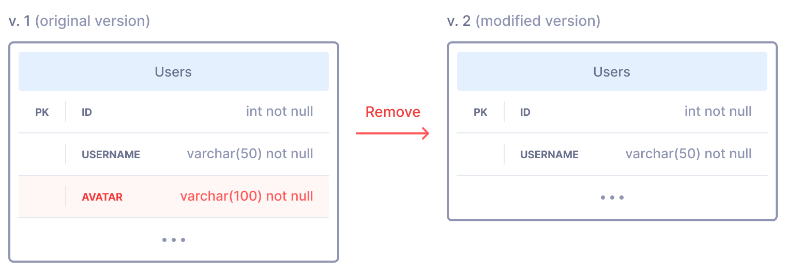
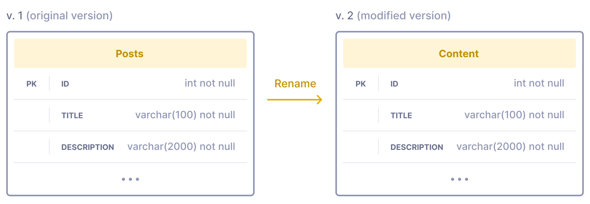

In this episode, we'll cover the basic principles of zero-downtime database
migrations and provide quick recipes for the most common scenarios.

**Contents:**

- [How does a deployment process work?](#how-does-a-deployment-process-work)
- [How to run the DB migration script](#how-to-run-the-db-migration-script)
- [What can cause downtime during database migration?](#what-can-cause-downtime-during-database-migration)
- [Example 1: downtime caused by a new column](#example-1-downtime-caused-by-a-new-column) ([solution](#solution-1))
- [Example 2: downtime caused by a column removal](#example-2-downtime-caused-by-a-column-removal) ([solution](#solution-2))
- [Example 3: renaming a column or changing its data type](#example-3-renaming-a-column-or-changing-its-data-type) ([solution](#solution-3))
- [Example 4: renaming a table](#example-4-renaming-a-table) ([solution](#solution-4))
- [A generic approach to maintaining backward DB compatibility](#a-generic-approach-to-maintaining-backward-db-compatibility)
- [Heavy DB operations](#heavy-db-operations)
- [Conclusion](#conclusion)

## How does a deployment process work?

Let's take a look at a simplified deployment process for a typical web
application. Most applications these days rely on load balancing and container
orchestration:


What happens when we need to deploy a new version of an application? The
deployment process replaces app instances one by one. It excludes them from the
cluster first, replaces app instances with newer versions, and then puts them
back in the cluster:


As shown in the animation above, the application version 2 gradually replaces
previous version 1 without any service interruption for end users.

This is all well and good, but what if application v2 requires some changes in
the database? Unlike application instances, the database is a shared stateful
resource, so we cannot simply clone it and use the same technique that we used
for application instances. The only viable solution for upgrading the database
is to modify it in place. At what point in time should we modify the database?

Since the application version 2 requires an upgraded DB version 2 to work
correctly, the database must be upgraded before putting any instance of
application v2 into production. Therefore, a deployment process that includes
a database upgrade should look like this:


## How to run the DB migration script

Please note that how you run a DB migration script matters. For example, it might be tempting to make it part of the
application startup, like this:

```bash
<run-db-migrations> && <launch-the-app>
```

The idea behind such an arrangement is that the first application instance
being launched will run the DB migrations, and for the other instances the
script will be a no-op since the DB is already upgraded.

Please **DON'T DO THIS.**

First, since we're launching multiple application instances in parallel on our
cluster, the DB migration script must handle parallel executions correctly.
Depending on the DB migration framework you're using, and how the script is
written, it may or may not do so. A migration has three main states — not
started, in progress, finished. The script must detect that another migration
is already in progress and wait. If it doesn't wait, it may cause crashes or
even corrupted data.

Second — even if DB migration scripts handle parallel executions correctly,
there's an issue with retries. It is important that the DB migration script
gets executed once and only once, and if it fails, the whole deployment
process must be stopped and rolled back. For example, if the migration
fails due to a timeout on a long heavy SQL operation, you don't want to retry
it again and again automatically. The reasonable solution would be to roll
back immediately after the first failure, investigate, fix the migration
script, and only then try again.

This is why the DB migration script is launched from a CI/CD server in the
animation above. But it doesn't necessarily have to be done in that way.
For example, it could be a one-time Kubernetes task that is launched as
a part of a deployment process or something like that. Just remember the main
principle — launch it only once, and if it fails — roll back immediately.

## What can cause downtime during database migration?

There are two main reasons for this:

1. **Backward incompatibility.** As shown above, a deployment process isn't
   instant, and at some point, the database is already upgraded, but older
   application instances are still running in production. If the newer database
   version is incompatible with the previous application version, it may cause
   errors and crashes in production until older application instances are fully
   replaced with newer ones.
2. **Heavy DB operations.** A database migration may include some heavy
   operations, which lead to increased DB server load or prolonged database
   locks. As a result, it may slow down the application or make it unresponsive
   during the DB upgrade.

Now, let's look at the most common cases related to the backward
incompatibility problem. We'll also briefly talk about heavy DB operations at
the end of this post.

## Example 1: downtime caused by a new column

Let's say we're building a new feature — user avatars. After registration,
every user will get a randomly generated avatar with an option to upload their
own. To implement this, we need to add the `avatar` column to the `Users` table:


How can we upgrade the database from v1 to v2 in this case? Our database
migration script should include the following operations:

1. Add the `avatar` field to the `Users` table, nullable;
2. Update all existing records in the `Users` table, generate random avatars;
3. Make the `avatar` field non-nullable.

And in the application code, we need to implement the following functionality:

1. Generate random avatars for new users;
2. Show user avatars where appropriate;
3. Provide an option for users to upload their custom avatars.

What will happen if we just naively push all of the above into production?
As we mentioned before, the database migration script will run first. Then the
application instances will be gradually replaced with their newer versions.
At some point in time, the previous application version, which doesn't know
anything about the `avatar` field yet, will be running against the upgraded DB
version, which already has that new field.

**It will effectively lead to broken user registrations** since application v1
will try to insert new records into the Users table without any value provided
for the avatar field, which is non-nullable. Of course, the problem will fix
itself after some time when all v1 application instances are replaced with v2.
However, since we're talking about "zero-downtime deployments," this is not
good enough for us. Let's see how we can deploy this new feature without any
downtime.

## Solution {#solution-1}

The trick is to split the feature deployment into multiple phases and deploy
them one by one, waiting for each phase to deploy completely before moving to
the next one. In this particular case, we need two phases:

### Phase 1 {#solution-1-phase-1}

|                  DB migration script                  | New app features                    |
|:-----------------------------------------------------:|:-----------------------------------:|
| Add the `avatar` field to the `Users` table, nullable | Generate random avatars for all new users under the hood |

The database migration script only adds a new nullable field and therefore
doesn't cause any issues with new records inserted by the previous app version.
Then the updated application version is deployed, and the new field becomes
populated for all new records.

### Phase 2 {#solution-1-phase-2}

|                        DB migration script                         |                                                     New app features                                                      |
|:------------------------------------------------------------------:|:-------------------------------------------------------------------------------------------------------------------------:|
| Generate random avatars for all existing users with empty avatars; | All remaining "avatar" features — show user avatars where appropriate, provide an option to upload their own avatar, etc. |
| Make the `avatar` field non-nullable                               |                                                                                                                           |

The database migration script updates existing user records by populating all
empty `avatar` values. After that, it makes the `avatar` field non-nullable.
Even if new registrations happen during the deployment, there will be no blank
values in this field since the app version that we deployed on Phase 1 already
generates avatars for all new users. Therefore, we can safely enforce the
"non-null" constraint and deploy all the remaining avatar features.

## Example 2: downtime caused by a column removal

Let's say that the "User avatars" feature we described in the previous example
didn't meet our expectations. It wasn't popular enough, so we decided to roll
it back. There will be no more user avatars, so we want to remove all
application functionality related to it and also remove the `avatar` column
from the DB:



As with the previous example, if we just naively push everything to production,
including the DB migration script, it will cause downtime.

**The application will be severely broken during the deployment.** As we
discussed above, the DB migration script will run first. Immediately after its
execution, there will be a time when the previous application version is still
running in production, but the `avatar` column no longer exists, so all
functionality related to it will be broken. How could we avoid this?

## Solution {#solution-2}

Use the same technique as with the previous example — split the deployment into
two phases:

### Phase 1 {#solution-2-phase-1}

|         DB migration script         |                                                 New app features                                                 |
|:-----------------------------------:|:----------------------------------------------------------------------------------------------------------------:|
| Make the `avatar` column nullable   | Remove all of the functionality related to avatars. Remove all mentions of the `avatar` column from the app code |

Making the column nullable doesn't break the older application version that is
still running in production and relies on the `avatar` column. At the same time,
it allows us to deploy a new application version that won't use this column in
any way.

### Phase 2 {#solution-2-phase-2}

|   DB migration script    | New app features |
|:------------------------:|:----------------:|
| Drop the `avatar` column |        -         |

After Phase 1 is deployed, there are no more mentions of the `avatar` column
anywhere in the application code, so we can safely drop it.

## Example 3: renaming a column or changing its data type

Let's say we'd like to upgrade the avatars feature that we described in
[example 1](#example-1-downtime-caused-by-a-new-column). Instead of storing
file names, we'd like to store full avatar URLs so that we can support avatars
hosted on different domains. Full URLs are noticeably longer, so we need to
extend the maximum length of the `avatar` column. Also, we need to convert
existing data to the new format by transforming file names into full URLs.
Lastly, it is a good idea to rename the column from `avatar` to `avatar_url`
to better reflect its new purpose:


In this case, the data migration script includes:

1. Changing the column data type, `varchar(100) -> varchar(2000)`;
2. Converting existing data from the old format (file names) to the new one — full URLs;
3. Renaming the column, `avatar -> avatar_url`.

And in the application code, we need to:

1. Save the data in the new format;
2. Read the data in the new format and process it accordingly.

If we simply push such a change to production, it will cause downtime.

**The application will be severely broken during the deployment.** As we
discussed above, the DB migration script will run first. During its execution
and for some time after its execution the previous application version will
still run in production. The first part of the script only extends the maximum
length of the stored data. Such an operation alone wouldn't cause any downtime.
However, the data transformation applied in the next step will cause incorrect
avatar handling since the previous application version still relies on the old
format. And the last step, which renames the column, will cause application
crashes, including broken user registrations. The previous application version
won't be able to read or write the data because the column name changed. The
application will remain broken until its new version is fully deployed. How can
we avoid this?

## Solution {#solution-3}

Use the same technique as with the previous examples — split the migration into
phases. This case is more complicated — we need four phases:

### Phase 1 {#solution-3-phase-1}

|              DB migration script               |                                                  New app features                                                  |
|:----------------------------------------------:|:------------------------------------------------------------------------------------------------------------------:|
|   Add the new `avatar_url` column, nullable;   | Start writing data to both the old `avatar` column and the new `avatar_url` column in their corresponding formats; |
| Don't change the existing `avatar` column yet. |                      Don't change the read logic yet — still read from the old avatar column.                      |

First, the DB migration script only adds a new nullable field, so no downtime.
The application starts writing data to both fields, preparing for the next
phase.

### Phase 2 {#solution-3-phase-2}

|                                                                         DB migration script                                                                         |                             New app features                             |
|:-------------------------------------------------------------------------------------------------------------------------------------------------------------------:|:------------------------------------------------------------------------:|
| Populate all empty values in the `avatar_url` column with values from the `avatar` column, while converting the data into the new format (file names to full URLs); |          Switch the reading logic to the new avatar_url column;          |
|                                                             Make the `avatar_url` column non-nullable;                                                              | Continue writing data to both `avatar` and `avatar_url` columns for now. |

The DB migration script populates the data in the new column by converting file
names stored in the old column to full URLs stored in the new column. Then, it
enforces the non-null constraint on the new field. It shouldn't cause any
problems since the app was already populating `avatar_url` for all new records.
The application version deployed in this phase switches to reading the data
from the new `avatar_url` field. It still writes the data to both old and new
fields, to ensure backward compatibility with the app version deployed on
Phase 1.

### Phase 3 {#solution-3-phase-3}

|        DB migration script         |                                   New app features                                    |
|:----------------------------------:|:-------------------------------------------------------------------------------------:|
| Make the `avatar` column nullable  | Stop writing data for the `avatar` column and remove all mentions of it from the code |

The DB migration script makes the avatar field nullable, so that the
application can stop writing data for it.

### Phase 4 {#solution-3-phase-4}

|                 DB migration script                 | New app features |
|:---------------------------------------------------:|:----------------:|
| Drop the old `avatar` column from the `Users` table |        -         |

After Phase 3 finishes deploying, we can remove the old column from the DB. No
application changes are required in this phase since the application was
already upgraded in the previous phases.

## Example 4: renaming a table

Surprisingly, renaming a table is more straightforward than renaming a column.
Imagine we'd like to rename the `Posts` table to more generic `Content`:



If we don't take any precautions, such a rename would cause downtime during the
deployment. The previous app version, which still runs in production, will try
to access the table using its old name, resulting in an error. Let's see how we
can avoid this.

## Solution {#solution-4}

In this case, we need two deployment phases:

### Phase 1 {#solution-4-phase-1}

|                                                      DB migration script                                                      |                                 New app features                                 |
|:-----------------------------------------------------------------------------------------------------------------------------:|:--------------------------------------------------------------------------------:|
|                                             Rename the `Posts` table to `Content`                                             | Update all SQL queries to use the new table name — `Content` instead of `Posts`  |
| In the same transaction, create an updatable view with the previous table name: `CREATE VIEW posts AS SELECT * FROM content`  |                                                                                  |

The only extra step we need to make in Phase 1 is adding an updateable view with the old table name so that the
previous app version can successfully read and write it.

### Phase 2 {#solution-4-phase-2}

|                      DB migration script                       | New app features |
|:--------------------------------------------------------------:|:----------------:|
| Remove the view that we created in Phase 1: `DROP VIEW posts`  |        -         |

And the second phase is simply a cleanup — removing the view we no longer need.

> Note for MySQL users: As of version 8.0, MySQL still doesn't support
> transactions for DDL operations. This means there could be a very short blip
> between renaming a table and creating a view during which queries to this
> table will fail. If this is unacceptable for your production environment,
> you may have to use a four-phase process similar to
> [renaming a column](#example-3-renaming-a-column-or-changing-its-data-type),
> which we described above.

## A generic approach to maintaining backward DB compatibility

As you can see, all three solutions above use the same technique — split the
deployment of a new feature into two or more phases to avoid any downtime
during deployment. Of course, these three examples don't cover all possible DB
migration cases, but they should help you understand the main idea. If you get
the idea and know how your deployment script works, you can develop solutions
for other cases yourself.


Quick recap:

- During the deployment, the data migration script runs first;
- After that, there will be a brief period when older application instances are
  running against a newer, upgraded version of the DB. This is a potentially
  risky moment when downtime caused by broken backward compatibility might
  happen;
- You can avoid this downtime by splitting your deployment into multiple phases
  if necessary. Split it in such a way that the previous application version,
  which is still running in production, is always compatible with the newer
  database version that you're going to deploy;
- The examples above ([1](#example-1-downtime-caused-by-a-new-column),
  [2](#example-2-downtime-caused-by-a-column-removal),
  [3](#example-3-renaming-a-column-or-changing-its-data-type),
  [4](#example-4-renaming-a-table)) illustrate how exactly you can plan your
  deployment phases to avoid downtime caused by broken backward compatibility.

## Heavy DB operations

Another common reason for downtime during the DB upgrade is that some
modifications performed by the database migration script can cause a heavy load
on the database or lead to prolonged locks on some tables, causing application
slowness or downtime.

As a rule of thumb, problems could emerge when modifying tables that store
a lot of data. The creation of new tables is fast, deletion is also fast, and
modifications of small tables usually don't cause any issues. But if you're
going to modify a large table, e.g., add or remove columns or change their
data type, create or modify indexes or constraints, it could be slow, sometimes
painfully slow. What could we do?

- **Tip #1: Use a modern DB engine.** Databases are constantly evolving. For
  example, one of the most requested features in the MySQL community was the
  ability to do fast DDL operations that won't require a full table rewrite.
  [MySQL v8.0 introduced noticeable improvements](https://dev.mysql.com/blog-archive/mysql-8-0-innodb-now-supports-instant-add-column/),
  including instant adding of new columns if certain conditions are met.
  Another example — in Postgres versions 10 or earlier, adding new columns with
  a default value caused a full table rewrite,
  [which was fixed in Postgres v11](https://www.2ndquadrant.com/en/blog/add-new-table-column-default-value-postgresql-11/).
  It doesn't mean that the DDL performance is already a solved problem of
  course, but upgrading to a newer DB server version could potentially make
  your life easier.
- **Tip #2: When modifying a large table, check what happens under the hood.**
  In many cases, you can reduce the risk of downtime by using a slightly
  different set of operations that will be easier for the database server to
  process. Here're some useful links:
  - [MySQL — Online DDL Operations](MySQL — Online DDL Operations)
  - Postgres — check the
    [django-pg-zero-downtime-migrations](https://github.com/tbicr/django-pg-zero-downtime-migrations#how-it-works)
    package that provides a detailed explanation of how locks are working in
    Postgres and which operations can be considered safe.
- **Tip #3: Make upgrades when the service has the least amount of traffic.**
  If an upgrade touches a large table, consider doing it during a period of low
  activity. It could be beneficial in two ways. First, the DB server will be
  less loaded and therefore could potentially complete the upgrade faster.
  Second, even despite careful preparation, such upgrades can be risky. It
  could be hard to fully test how the upgrade will work under the production
  load. Therefore, it makes sense to reduce the blast radius if downtime
  happens. During periods of low activity, the impact will be lower due to
  fewer users being online.
- **Tip #4: Consider slow-running migrations.** Some tables can be so large
  that the traditional migration way is simply not a viable option for them.
  In such cases, you can consider embedding the data migration code right into
  your application, or use a special utility like GitHub's online schema
  migration for MySQL. A slow-running migration can work in production for
  days or even weeks. It gradually converts the data by small chunks, so you
  can carefully balance the load on the database while making sure that it
  doesn't cause slowness or downtime.

## Conclusion

While zero-downtime database migration requires some effort, it's not that
complex. The two main reasons for downtime are:

1. Failure to maintain backward compatibility;
2. Heavy DB operations.

To solve the backward compatibility problem, you may need to deploy a new
feature in multiple phases instead of pushing everything into production at
once. This article covers the most common scenarios
([1](#example-1-downtime-caused-by-a-new-column),
[2](#example-2-downtime-caused-by-a-column-removal),
[3](#example-3-renaming-a-column-or-changing-its-data-type),
[4](#example-4-renaming-a-table)) in detail and provides generic guidelines on
how to avoid downtime in other cases.

The [heavy DB operations](#heavy-db-operations) section above briefly covers
the second problem and provides some links for further reading.

I hope this article may help you avoid some downtime in your project. Less
downtime enables more frequent deployments, and therefore makes development
faster. Happy migrations!
