During a website or web application update, there’s a risk of downtime —
a potential trigger for a downward spiral of problems. Business stakeholders
often worry that users will notice disruptions and leave, leading them to delay
updates “for a more convenient time.” This slows development, replacing small,
frequent releases with larger, riskier batches.

The bigger the update, the more things can go wrong. It also demands more time
for debugging and testing. Over time, this cycle fuels tension in communication
between developers and business teams.

The good news is that it’s pretty much avoidable. Zero-downtime deployment
addresses these challenges head-on. It allows teams to return to a rhythm of
small, frequent updates, keeping development agile and the business side happy.

Today, we’ll dive into the core principles of zero-downtime deployment for web
applications. We use these methods at ivelum extensively, and while there could
be some edge cases not covered here, we believe this post covers the basics
for most projects.

## Setting up automated monitoring to know where problems occur

The first step to zero-downtime deployment is tracking downtime before users
notice it and start complaining. Many things could be monitored. If you're
unsure where to start - take a look at [The Starter Pack](../lean-monitoring/),
which covers the essential needs of a small-to-medium project.

Once monitoring is in place, what exactly can go wrong during a deployment?
A problem could occur in any main component: the backend, the frontend, or the
database. Let’s take a closer look.

## Handling DB migrations without downtime

Some application changes require an upgraded database to work correctly.
Database migration must be the first step in our CD pipeline, prior to updating
the backend or doing anything else:

1. Update the database;
2. Update the backend;
3. ...
4. PROFIT!

This sequence is important because new backend app instances won’t work
correctly if the DB isn’t updated, so if we care about zero downtime, we must
update the database first. How we launch the database migration script is also
important. It might be tempting to run it as a part of the backend application
startup like this:

```shell
<run-db-migrations> && <launch-the-app>
```

Please **DON'T DO THIS**.

It won't cause any problems if we run just a single instance of the app, but
it's a terrible idea in production environments with multiple app instances.
We should launch the DB migration script exactly once, and if it fails, the
whole deployment process must be stopped and rolled back. For example, if the
DB migration fails due to a timeout on a heavy SQL operation, we shouldn't
retry it again with the next app instance launch, or we can cause severe
downtime by those multiple attempts. We should roll back immediately after the
first failure, investigate, fix the migration script, and only then try again.

Next, we must carefully plan what to include in the DB migration script.
Downtime during the DB migration is usually caused by one of the two main
reasons:

1. Breaking backward compatibility with the previous version of the app;
2. Heavy DB operations that overload the server.

The good news is that both problems can be successfully mitigated. However,
there are many nuances that are worth a separate post, and we actually covered
them in one of our previous posts. Please check it out:

- [Migrating a production database without any downtime](../zero-downtime-db-migrations/)

## Deploying the backend



When deploying backend code updates, an application server restart is typically
required to load the new code into memory. During the restart, some requests
may be lost, causing downtime. In most modern projects, it’s handled with
container orchestration. The main principle is simple: launch new application
instances in parallel with the old ones and then switch traffic on the load
balancer. Strategies may vary. It can be a
[rolling update](https://kubernetes.io/docs/tutorials/kubernetes-basics/update/update-intro/)
when we launch new instances one by one, or we could replace them all at once
(so-called [blue-green deployment](https://docs.aws.amazon.com/whitepapers/latest/overview-deployment-options/bluegreen-deployments.html)).

Alternatively, some projects rely on graceful reload, supported by application
servers like Nginx Unit, uWSGI, PHP-FPM, and others. In this case, the
deployment script tells the application server to do a hot code reload, and the
application server tries to do it without dropping a single request.

## Updating the frontend

Depending on how we built our frontend, we may have more or fewer items to care
about. Let's start with the most obvious, which is relevant to almost everyone.

### Updating caches—browser and CDN

So-called "static resources," including CSS, JavaScript, and images, are
usually cached in browsers and CDNs, which is a good thing. Static resources
rarely change, so we can significantly speed up our web app if we don't load
them again with every page request. However, sometimes they might change—when
we update the app, and in this case, old cached versions may become a problem.
If they're not updated, they can cause broken app layouts or functionality.

Fortunately, the fix is relatively straightforward. For every static resource
that might ever change, let's update its URL with every new app version. For
example, we can do this by adding the app version (or CI build number) to the
query string:

```html
<html>
  ...
  <script src="https://cdn.teamplify.com/app.js?7127"></script>
  ...
</html>
```

After the app update, the backend returns HTML with new links that neither the
user's browsers nor our CDN have seen before, effectively forcing them to load
the latest content.

### Updating SPA

But what if we built our frontend as a Single-Page Application (SPA)? By
default, it doesn't do a full page reload when we navigate the app. If the app
update happens in the middle of a user's session, they will still have the old
version of the frontend app loaded in their browser, but the backend is already
new, which may cause problems. Of course, if we did our homework and updated
the caches as described above, these problems would disappear as soon as they
refresh the page, but how do they know they need to refresh? Some users keep
their browser tabs open for days or even weeks.

Ideally, the frontend app should somehow receive a signal that a new version is
available. After receiving such a signal, it can reload itself automatically so
that users don't have to do anything and can continue to work normally. This
idea can be implemented in various ways. Let's see a concrete example of how
we did it in one of our projects, [Teamplify](https://teamplify.com):

--IMAGE--

Both the frontend and backend use the build number from the CI server to be
aware of their version. The backend includes its version in the HTTP response
headers for every API request. The frontend compares the version from the
backend with its own. If they don’t match, it triggers an update.

But the update is not just an immediate forced reload; we don’t want to
frustrate our users or risk losing unsaved data they might have entered on the
page. Instead, we use a deferred reload. It means we schedule the reload to
trigger at the next convenient moment, which can be one of the following:

- **When the user clicks a link.** Usually, this action performs without a full
  page reload, but if the frontend is outdated, we adjust the router so that
  the next link click triggers a full reload.
- **When an application error has already occurred** on the frontend. Since
  there is an error, and we know a new version is available, it makes perfect
  sense to reload the page—this might even resolve the issue.

### Surviving rolling updates

When we gradually update our backend instances, there might be a situation when
an API request from the new frontend app hits an old backend instance. Here's
the problematic sequence:

1. We started updating the app using a rolling update, and it's in progress.
   Some of the app instances are already new, and some are still old;
2. The user's first request hits a new backend instance, and it responds with
   a link to the new version of the frontend app. The new frontend app is
   loaded into the user's browser;
3. The new frontend app sends an API request, and since some old backend
   instances are still running, it might hit one of them. If the new frontend
   is incompatible with the old backend, it might result in an error.

For the Teamplify project, we initially relied on so-called "sticky sessions"
to mitigate this problem. The idea is that the load balancer "remembers"
(via special cookies) from which backend instance a user's request was
originally served and routes all subsequent requests from this user session
to the same instance. While it worked well for preventing problems during the
app update, we found that it resulted in sub-optimal workload distribution
across backend instances. If one client generated too many requests, they all
were directed to the same instance, creating a "hot spot" and causing app
slowness.

After researching possible solutions, we decided to avoid rolling updates
altogether—we switched to the "blue-green" deployment strategy where backend
instances are replaced all at once, and the problem disappeared. This solution
might not be for everyone since it requires extra capacity on the app servers.
Before switching to the new version, all new backend instances must be up and
running in parallel with the old ones. Depending on your project
infrastructure, you may or may not have such extra resource capacity. For
Teamplify, we had such a capacity, so it was an easy solution.

Alternative solutions may include some logic built into the app, for example:

- Require a specific API version in all requests coming from the frontend app
  and route them accordingly of the load balancer;
- Implement retry logic in the frontend app. If it receives a response from an
  older backend instance, it should try again after a while, hoping that the
  request will be served from a new instance next time.

## Summary

In this post, we covered the basic principles of zero-downtime deployment for
all major web app components: the backend, the frontend, and the database. The
above strategies apply to most web projects, enabling engineers to roll out
updates frequently without downtime.

However, this is not an exhaustive guide, and there's a chance you may run into
a tricky situation that is not covered here. If so, please feel free to reach
out to us via [this website](/contact/) or [on X](https://x.com/ivelum_dev),
and we'll be happy to brainstorm with you.


