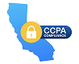

### Achieve compliance faster

We work with clients across various compliance requirements, including SOC 2, HIPAA,
FedRAMP, GDPR, and CCPA. Even if you're not planning to pursue SOC 2 in the short term,
adopting the best security practices now will make it much easier to achieve compliance
later. We're here to help you do just that.

- 
- 
- 
- 
- 
{.solutions--logo-list}
